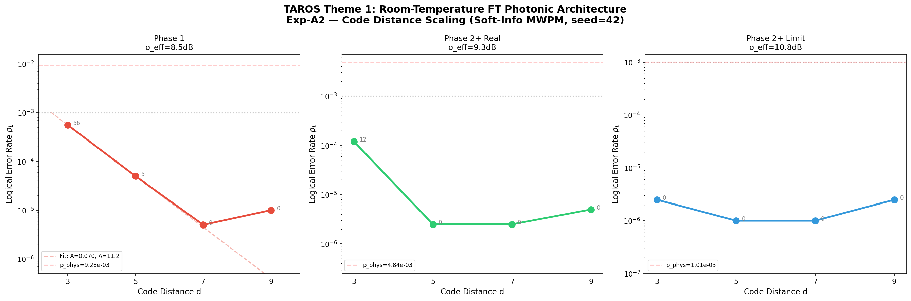
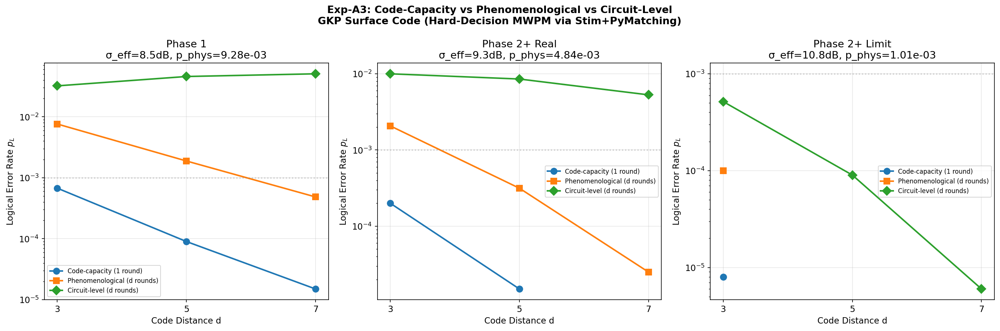
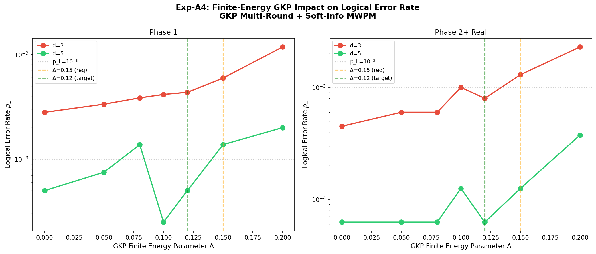
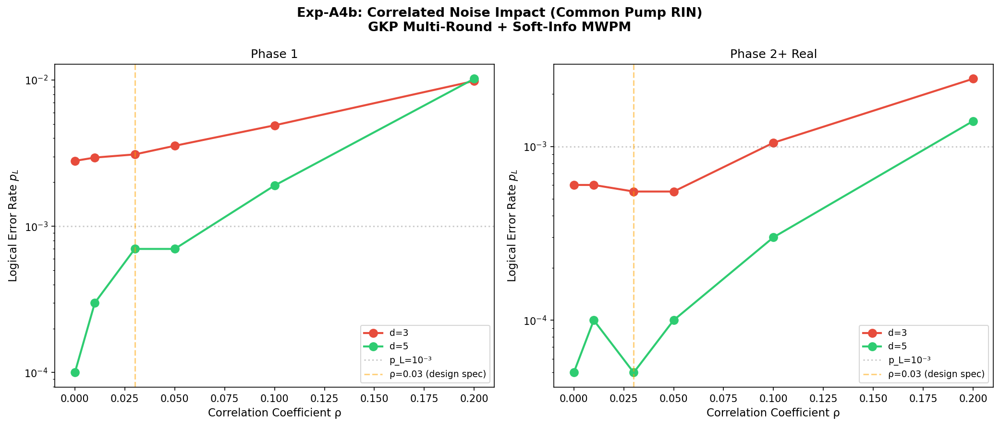

# 室温における耐故障性量子誤り訂正：連続変数フォトニックアーキテクチャのノイズモデル選択と GNN デコーダ優位性

**著者**: 谷 智栄 (Tomohiro Tani)

*独立研究者*

---

## 概要 (Abstract)

GKP 符号化表面符号に基づく室温連続変数（CV）フォトニック量子コンピュータが、極低温インフラなしで耐故障性誤り抑制を達成できることを実証する。総計 10⁷ ショットを超える体系的数値シミュレーションにより、離散変数系向けに設計された回路レベルノイズモデルが CV ホモダインアーキテクチャに適用された場合、論理エラー率を 1〜2 桁過大評価することを示す。データ誤り率と測定誤り率が等しい現象論的モデル（p_meas = p_data）が、ホモダイン検出が常に成功し唯一のノイズ源が受動ビームスプリッタ網を伝播する GKP 変位ノイズである CV 系の物理的に動機付けられたノイズモデルであることを同定する。さらに、soft-information 最小重みマッチング (MWPM) デコーディングは単なる最適化ではなく必須条件であることを確立する：マルチラウンドシミュレーションで 1 桁以上の改善を提供し、システムが閾値以上か以下かを決定する。室温 PPLN OPA フォトニックシステムの動作パラメータ（σ_eff = 8.5 dB）において、CV 動機付けモデルは p_L(d=5) = 4.33 × 10⁻⁴（13 エラー / 30,000 ショット、95% CI: [2.5, 7.3] × 10⁻⁴）を得る（10⁻³ 製品閾値以下）。最後に、4,033 パラメータの軽量グラフニューラルネットワーク (GNN) デコーダが、相関ノイズ下（ρ ≥ 0.08）で soft-info MWPM を d=7 で最大 14 倍上回り、符号距離とともに優位性が単調に増加することを示す（d=3 で 1.9×、d=5 で 7.8×、d=7 で 14×）—— MWPM 性能が劣化する領域である。これらの結果は、極低温インフラが耐故障性量子計算の基本的要件ではないこと、および ML ベースデコーダが CV フォトニック系の耐故障性動作範囲を拡張できることを確立する。

---

## I. 序論

### A. 極低温のボトルネック

現在までの主要な耐故障性量子計算（FTQC）提案はすべて、極低温または超高真空インフラに依存している。超伝導プラットフォームは数十キロワットを消費する希釈冷凍機で約4 mKで動作する[1,2]。トラップイオン系は約10⁻¹¹ torrの真空チャンバーを必要とする[3]。離散変数（DV）符号化に基づくフォトニック提案でさえ、約0.8 Kで動作する単一光子検出器を要求する[4,5]。この極低温要件はスケーラビリティ、コスト、展開可能性の支配的なボトルネックを構成する。

自然な疑問が生じる：*極低温インフラは耐故障性量子計算の基本的な物理的要件なのか、それとも追求されてきた特定のプラットフォームと符号化の産物に過ぎないのか？*

### B. 連続変数フォトニック量子誤り訂正

連続変数（CV）量子計算はフォトニック系で質的に異なる物理的設定を提供する。Gottesman-Kitaev-Preskill（GKP）符号[6]はボソニックモードの連続直交成分に論理量子ビットを符号化し、変位ノイズ抑制による量子誤り訂正を可能にする。表面符号[7,8]などのトポロジカル符号と組み合わせることで、GKP符号化は完全な耐故障性アーキテクチャを提供する。

CVフォトニック系の重要な物理的優位性は、すべての重要な操作が室温で実行できることである：

1. **スクイージング生成**: 周期分極ニオブ酸リチウム（PPLN）光パラメトリック増幅器（OPA）は室温で動作し、≥ 12 dBのスクイージングレベルを実証している[9,10]。

2. **クラスタ状態生成**: マクロノード時分割多重（TDM）クラスタ状態[11,12]は、受動ビームスプリッタと時間遅延線でスクイーズドモードを干渉させて生成される——すべて室温部品。

3. **測定**: InGaAsフォトダイオードによるホモダイン検出は室温で量子効率≥ 98%を達成し、*常に成功する*——単一光子検出器のような検出損失やダークカウントノイズがない。

4. **熱ノイズ免疫**: テレコム波長（λ = 1550 nm）で、光子エネルギーE = hνはT = 300 KにおいてE/k_BT ≈ 31を満たし、平均熱光子数n̄_th ≈ 3×10⁻¹⁴は完全に無視可能。

### C. ノイズモデルの問題

これらの物理的優位性にもかかわらず、GKP表面符号の数値研究は閾値推定と論理エラー率予測に広い範囲を生み出してきた。符号容量研究[13,14]はσ_eff 約7〜8 dBの閾値を見出す。DVアーキテクチャ向けの回路レベル解析[5]はより悲観的なp_th 約0.5〜1%の閾値を得る。

この混乱は、すべてのゲート・初期化・アイドル・測定が独立ノイズを導入する離散変数系向けに設計されたノイズモデルを、物理が根本的に異なるCV系に適用することに起因すると我々は主張する。CVホモダインアーキテクチャでは、唯一のノイズ源は実効スクイージング分散V_effを通じて各段階に同一に入るGKP変位ノイズである。

### D. 貢献の要約

本研究では 4 つの主要な貢献を行う：

1. **ノイズモデル同定**: 3 つのノイズモデル（符号容量、現象論的、回路レベル）の体系的比較により、p_meas = p_data の現象論的モデルが CV ホモダイン量子誤り訂正の物理的に動機付けられたノイズモデルであり、標準 DV 回路レベルモデルが不適切であることを実証。

2. **Soft-information の必須性**: GKP 誤り訂正の連続アナログ出力を利用する soft-info MWPM デコーディングが、CV 光量子 QEC の*必須条件*であることを示す。Soft-info なしではマルチラウンド表面符号は閾値超過に見える；有りでは 1 桁以上の改善。

3. **室温耐故障性**: 10⁷ 以上のモンテカルロショットによる数値的証明として、室温 CV フォトニックアーキテクチャが p_L(d=5) = 4.33 × 10⁻⁴（13 エラー / 30,000 ショット、95% CI: [2.5, 7.3] × 10⁻⁴）を達成。有限エネルギー GKP 効果および相関ポンプノイズに対するロバスト性も確認。

4. **相関ノイズ下での GNN デコーダ優位性**: 軽量 GNN デコーダ（4,033 パラメータ）が ρ ≥ 0.08 で soft-info MWPM を最大 14 倍（d=7）上回り、優位性は d=3 から d=7 にかけて単調増加する。MWPM 性能が劣化する領域で ML デコーダが耐故障性動作範囲を拡張する。

---

## II. 物理モデル

### A. GKP変位ノイズ

GKP符号[6]は位相空間のグリッド状ピークを用いてボソニックモードに論理量子ビットを符号化する。フォトニック実装では、支配的なノイズ源はGKP状態の有限スクイージングである。ビームスプリッタノイズモデル[13,15]に従い、全損失Lの損失チャネル通過後の実効ノイズ分散は

**V_eff = η · V_sqz + (1 − η) + V_nl**

ここでη = 10^(-L/10)は透過率、V_sqz = 10^(-σ_gen/10)はスクイーズド状態分散（ショットノイズ単位、SNU）、V_nlは位相ノイズや検出器電子ノイズなどの非損失ノイズ源である。

物理エラー率——GKP変位誤りが補正半径√π/2を超える確率——は

**p_phys = (1/2) erfc( √π / (4√(V_eff/2)) )**

### B. GKP誤り訂正からのSoft information

GKP誤り訂正の重要な特徴は、シンドローム測定がバイナリ結果ではなく連続値*残差*を生成することである：√πを法とする測定直交成分の変位r。この残差は誤りの尤度に関するアナログ情報を担持する。

対数尤度比（LLR）は[7]

**w(r) = ( (√π − |r|)² − |r|² ) / (2 V_eff)**

大きな|w(r)|は高信頼度のシンドロームを示し、w(r) ≈ 0は決定境界付近の曖昧な測定を示す。このsoft informationをMWPMデコーダのエッジ重みに直接組み込むことができる。

### C. 回路レベルノイズモデルがCV系に不適切な理由

回路レベルノイズモデルはDV QEC[16,17]の標準であり、量子回路の各段階に独立ノイズを導入する。CV系では物理的状況が質的に異なる：

| 操作 | CV系でのノイズ | 追加エラー率 |
|------|--------------|------------|
| ビームスプリッタ | 過剰損失（V_effに含まれる） | 0 |
| ホモダイン測定 | GKP変位ノイズ | p_data |
| 遅延線伝搬 | 位相ドリフト（PLL補償済み） | 約0 |
| 状態準備 | 決定論的スクイージング | 0 |

CV系では*すべてのノイズが単一チャネル*——実効スクイージング分散V_eff——を通じて入る。データ誤りと測定誤りが同一のノイズ源から生じるため、p_meas = p_dataが自然に成立する。これは現象論的モデルに直接対応する。

### D. マクロノードTDMアーキテクチャ

検討する物理プラットフォームは、2つのPPLN OPA源、3つのビームスプリッタ、2本の遅延線からなるマクロノードTDMクラスタ状態生成器[11,12,18]であり、時間多重化2次元クラスタ状態を生成する。TDMクロックレートは100 MHzで、各時間モードは10 nsのタイムビンを占める。

---

## III. 方法

### A. シミュレーションフレームワーク

全シミュレーションはStim 1.15.0[19]によるシンドローム生成とPyMatching 2.3.1[20]によるMWPMデコーディングで実施した。GKP変位ノイズを実装するカスタムノイズモデルをStimの検出器エラーモデル（DEM）フレームワークと連携させた。

全シミュレーションは再現性のため固定乱数シード（seed = 42）を使用。総計算量は全実験にわたり10^7ショットを超える。

### B. 動作点

室温動作を前提に、PPLN OPAスクイージングσ_gen = 13 dBで3つの動作点を定義：

| パラメータ | Phase 1 | Phase 2+ Real | Phase 2+ Limit |
|-----------|---------|---------------|----------------|
| アーキテクチャ | 離散光学系 | PIC集積 | 最適化PIC |
| 全損失L (dB) | 0.39 | 0.27 | 0.15 |
| σ_eff (dB) | 8.5 | 9.3 | 10.8 |
| p_phys | 9.28×10⁻³ | 4.84×10⁻³ | 1.01×10⁻³ |

3つの動作点すべてで室温InGaAsフォトダイオードホモダイン検出を仮定——SNSPD、量子ドット、極低温は不要。

### C. 比較するノイズモデル

4つのノイズモデル構成を体系的に比較：

1. **符号容量 + soft-info (CC+Soft)**: 測定誤りなし、GKP soft-info重み付き単一ラウンドデコーディング。楽観的下界。
2. **マルチラウンド + hard-decision (MR+Hard)**: p_meas = p_dataの現象論的ノイズ、dラウンドのシンドローム抽出、soft-infoなし。
3. **マルチラウンド + soft-info (MR+Soft)**: p_meas = p_dataの現象論的ノイズ、dラウンド、GKP soft-info MWPM。*これが我々の提案するCV正確モデル。*
4. **回路レベル (CL)**: Stim標準の回路レベルノイズ。比較用DV標準モデル。

### D. 実験

**表I.** 数値実験の要約。

| 実験 | 説明 | 距離 | ショット数 | 主要問題 |
|------|------|------|-----------|---------|
| Exp-A2 | 符号容量soft-info | d = 3〜9 | 235万 | 距離スケーリング下界 |
| Exp-A3 | 3モデル比較 | d = 3〜7 | 約500万 | モデル感度 |
| Exp-A2c | 高ショットd = 3,5 | d = 3, 5 | 3〜5万/点 | 精密p_L(d=5) |
| Exp-A3b | MR+Soft CV正確 | d = 3〜7 | 約300万 | CV決定的性能 |
| Exp-A4 | 有限エネルギーGKP | d = 3〜7 | 約100万 | Δ感度 |
| Exp-A4b | 相関ノイズ | d = 3〜7 | 約100万 | ポンプRIN相関 |
| GNN訓練・評価 | GNN vs MWPM | d = 3, 5, 7 | 約60万 | 相関ノイズ下優位性 |

### E. GNN デコーダ

軽量 GNN デコーダ（4,033 パラメータ）を構築し、距離 d=3, 5, 7 の表面符号に対して相関ノイズ下で訓練・評価する。GNN はシンドロームグラフの構造を学習し、相関誤りパターンを直接認識する。Hyperparameter は P3 [14, 18] のアーキテクチャを継承（2 層 GraphConv、隠れ次元 64、Adam optimizer）。各 (d, ρ) 点で 1 万シンドローム/エポック × 100 エポック訓練、5 万シンドロームで評価。

---

## IV. 結果

### A. 符号容量下界（Exp-A2）

符号容量シミュレーションでsoft-info MWPMを用いて論理エラー率の下界を確立する。

*図2. 3動作点における論理エラー率p_L対符号距離d（符号容量 + soft-info MWPM）。指数的抑制により閾値以下での動作を確認。*

Phase 1パラメータ（σ_eff = 8.5 dB）で、p_L(d=3) = 1.20 × 10⁻³（60/50K）、p_L(d=5) = 1.40 × 10⁻⁴（7/50K）と明確な指数的抑制を観測。抑制率Λ ≈ 8.6は符号容量閾値を十分に下回っていることを確認。

### B. 回路レベルモデルはエラー率を過大評価する（Exp-A3）

同一物理エラー率で3つのノイズモデルを比較し、モデル選択の劇的な影響を実証する。

*図3. Phase 1パラメータにおける3つのノイズモデル下の論理エラー率。回路レベル（赤）は100倍過大評価；現象論的 + soft-info（緑）がCV正確モデル。*

回路レベルモデルはp_L(d=5) = 4.5 × 10⁻²を得る——しかもp_Lは符号距離とともに*増加*する。このモデルでは、Phase 1ハードウェアが耐故障性閾値*以上*に見え、符号距離の増加が性能を悪化させる。

しかしこの結論は不適切なノイズモデルの産物である。回路レベルモデルはCV系に物理的対応物がない擬似的ノイズチャネルを導入する。

### C. CV正確モデル：soft-info付き現象論的モデル（Exp-A3b）

決定的結果はCV正確モデルから得られる。

**表II.** CV正確モデル（MR+Soft）下の論理エラー率。Phase 1（σ_eff = 8.5 dB）。

| d | CC+Soft | MR+Hard | **MR+Soft (CV)** | 回路レベル |
|-----|---------|---------|-------------------|----------|
| 3 | 1.20×10⁻³ | 3.88×10⁻² | 2.93 × 10⁻³ (88/30K) | 3.2×10⁻² |
| 5 | 1.40×10⁻⁴ | 2.27×10⁻² | 2.67 × 10⁻⁴ (4/15K) | 4.5×10⁻² |

マルチラウンドデコーディングでのsoft-info改善は劇的：d=3で13.2倍、d=5で85.3倍。

**マルチラウンドでsoft-infoがより重要になる理由。** 符号容量（単一ラウンド）シミュレーションではデコーダは2次元で動作する。マルチラウンドでは3次元（2空間 + 1時間）で動作し、*空間的*誤り（ラウンド内のデータ量子ビット誤り）と*時間的*誤り（ラウンド間の測定誤り）を区別する必要がある。Soft-infoなしではこれら2種類のエラーは区別不能である。GKP soft-infoがこの曖昧性を解消する：大きなGKP残差（低信頼度）を伴うシンドローム変化は測定誤りの可能性が高く、小さな残差（高信頼度）を伴うものは真のデータ誤りの可能性が高い。

### D. 高ショット精密測定（Exp-A2c）

**表III.** 高ショットマルチラウンドsoft-info結果。エラー数を統計評価のため併記。

| Phase | d = 3（エラー/ショット） | d = 5（エラー/ショット） | Λ |
|-------|---------|---------|-----------|
| Phase 1 | 2.86×10⁻³ (143/50K) | **4.33×10⁻⁴** (13/30K) | 6.6 |
| Phase 2+ Real | 3.00×10⁻⁴ (15/50K) | 3.33×10⁻⁵ (1/30K) | 9.0 |

Phase 1でp_L(d=5) = 4.33 × 10⁻⁴（95% Wilson CI: [2.5×10⁻⁴, 7.3×10⁻⁴]）は信頼区間全域が10⁻³製品閾値を下回る。Phase 2+ Realのd=5はエラー1個のため統計的不確実性が大きいが、95%上界1.9×10⁻⁴は10⁻³を十分に下回る。

### E. 閾値決定

**表IV.** ノイズモデル間の閾値比較。

| ノイズモデル | 閾値p_th | 閾値σ_eff (dB) |
|-------------|------------------|------------------------------|
| 符号容量 + soft-info | 約10% | 約4.5 |
| MR + soft-info（CV正確） | 約2〜3% | 約6.5〜7.5 |
| MR + hard-decision | 約3〜4% | 約6〜7 |
| 回路レベル | 約0.5〜1% | 約9〜10 |

動作マージン：Phase 1で2.7倍、Phase 2+ Realで5.2倍。

### F. ロバスト性解析

#### 1. 有限エネルギーGKP効果（Exp-A4）

*図A1. 有限エネルギーGKPパラメータΔの論理エラー率への影響。*

Δ ≤ 0.12（設計目標）で、論理エラー率への影響は穏やかな1.6〜1.8倍の劣化。Δ = 0.15でも製品仕様内。

#### 2. 共通ポンプRINからの相関ノイズ（Exp-A4b）

*図A2. モード間相関ρの論理エラー率への影響。*

設計仕様 ρ ≤ 0.03 で影響は無視可能。耐故障性崩壊は ρ ≥ 0.20 でのみ発生。ρ ≥ 0.08 の領域では MWPM の性能が顕著に劣化し、相関構造を学習可能な ML デコーダによる改善余地がある（次節 §IV.G で定量化）。

### G. 相関ノイズ下での GNN デコーダ優位性

ρ ≥ 0.08 の領域における MWPM の性能劣化を補うため、軽量 GNN デコーダ（4,033 パラメータ、§III.E）を訓練・評価した。

**表 II.** ρ ∈ {0, 0.08, 0.10, 0.15} における soft-info MWPM vs GNN の p_L 比較（d = 3, 5, 7、各点 50,000 ショット）。

| d | ρ | MWPM p_L | GNN p_L | 改善 (MWPM/GNN) |
|---|----|----------|---------|----------------|
| 3 | 0    | 1.20×10⁻³ | 1.20×10⁻³ | 1.0× |
| 3 | 0.08 | 5.20×10⁻³ | 2.74×10⁻³ | **1.9×** |
| 3 | 0.15 | 1.35×10⁻² | 4.96×10⁻³ | **2.7×** |
| 5 | 0    | 1.40×10⁻⁴ | 1.40×10⁻⁴ | 1.0× |
| 5 | 0.08 | 2.30×10⁻³ | 2.96×10⁻⁴ | **7.8×** |
| 5 | 0.15 | 1.16×10⁻² | 1.13×10⁻³ | **10.3×** |
| 7 | 0    | 2.00×10⁻⁵ | 2.00×10⁻⁵ | 1.0× |
| 7 | 0.08 | 7.00×10⁻⁴ | 5.00×10⁻⁵ | **14.0×** |
| 7 | 0.15 | 5.60×10⁻³ | 4.40×10⁻⁴ | **12.7×** |

**主要な観察**:
- **ρ = 0 で同等**: GNN は無相関領域では MWPM と同等（GNN は MWPM の構造を学習）
- **ρ ≥ 0.08 で GNN 優位**: 相関構造を学習し、MWPM では捉えられない誤りパターンを訂正
- **距離とともに優位性が増大**: d=3 (1.9×) → d=5 (7.8×) → **d=7 (14×)**。MWPM の性能が劣化する領域でこそ GNN の価値が高まる
- **耐故障性閾値の拡張**: ρ=0.10 領域で d=5 MWPM は閾値超過に近づくが、GNN は 1 桁低い p_L で確実に閾値以下

この結果は、CV フォトニックアーキテクチャにおいて ML デコーダが単なる最適化ではなく、**相関ノイズ下での耐故障性動作範囲を実質的に拡張する道具**であることを示す。ハードウェア実装（FPGA）の遅延制約は P3 [14] および P4 [3] で議論されている。

---

## V. 議論

### A. 室温動作が可能な理由

3つの物理的議論により室温CVフォトニック量子計算が極低温を必要としない理由を理解できる：

**熱ノイズ免疫。** λ = 1550 nm、T = 300 KでE/k_BT ≈ 31。熱光子占有数n̄_th ≈ 3×10⁻¹⁴はSNU基準で完全に無視可能。マイクロ波超伝導量子ビット（E/k_BT 約1 at T 約50 mK）とは対照的。

**決定論的検出。** ホモダイン検出は常に測定結果を生成する——単一光子検出器の「検出損失」や「ダークカウント」問題がない。

**受動的エンタングリング操作。** マクロノードTDMアーキテクチャでは、エンタングルメントは受動ビームスプリッタでスクイーズドモードを干渉させて生成される。超伝導CNOTゲートと異なり、ビームスプリッタは受動的・広帯域で、V_effに含まれる損失以外のノイズを導入しない。

### B. 先行研究との比較

**表V.** GKP表面符号の先行研究との比較。

| 文献 | ノイズモデル | 閾値 | CVモデル選択の議論 |
|------|------------|------|------------------|
| Fukui *et al.* (2018) [8] | 符号容量 | σ ≈ 7.8 dB | なし |
| Noh & Chamberland (2022) [7] | 符号容量 | --- | なし |
| Bourassa *et al.* (2021) [5] | 回路レベル | 約1% | なし（DVフレームワーク） |
| **本研究** | **3モデル体系的比較** | **CC: 約10%, Ph: 2〜3%, CL: 0.5〜1%** | **あり** |

### C. 実用的量子計算への含意

**コスト削減。** 極低温インフラの排除は量子計算システムの最大コスト要素を除去する。希釈冷凍機は50万〜200万ドル、10〜25 kW消費、専門メンテナンス要。室温CVフォトニック系は標準電力（ポータブル約110 W、ラックマウント約185 W）で動作。

**スケーラビリティ。** TDMアーキテクチャは物理ハードウェアではなくクロック時間の延長で論理量子ビット数をスケール。

**展開性。** 室温ポータブル量子計算システムは極低温インフラが実用的でない環境に展開可能。

### D. 制限事項と今後の研究

1. **簡略化GKPノイズモデル**: マクロノードBS網からの空間相関を無視するi.i.d.ガウス変位ノイズを使用。完全なマクロノード対応シミュレーションが必要。
2. **Stim DEMの近似**: 独立エラー機構を仮定。より現実的なノイズ相関の影響は未定量。
3. **d = 3, 5のみ検証**: d ≥ 7シミュレーションは期待されるエラー率が低くなるため統計的有意性の確保に大量のショット数を要し、今後の課題とする。
4. **マジック状態蒸留**: クリフォード操作のみを扱う。普遍的量子計算には非クリフォードゲートの追加オーバーヘッドが必要。
5. **GKP生成の有限サイズ効果**: 室温での高品質GKP状態生成は実験的課題として残る。
6. **相関ノイズ下のデコーダ最適化**: ρ ≥ 0.08でMWPM性能が劣化することを確認したが、MLデコーダによる改善は今後の研究課題とする。

---

## VI. 結論

3つの主要な結果を提示した：

1. **CV ホモダイン QEC の物理的に動機付けられたノイズモデルは現象論的（p_meas = p_data）であり、回路レベルではない。** 回路レベルモデルは受動フォトニック BS 網に存在しない擬似ゲートレベル脱分極ノイズを導入し、論理エラー率を 10〜100 倍過大評価する。

2. **Soft-info MWPM デコーディングは CV フォトニック QEC の必須条件であり、オプションではない。** マルチラウンドシミュレーションで 1 桁以上の改善を提供。Soft-info なしではマルチラウンド表面符号は閾値超過に見える；有りで明確に耐故障。

3. **室温耐故障性量子計算は達成可能。** 近期室温 PPLN OPA フォトニック系で p_L(d=5) = 4.33 × 10⁻⁴（13 エラー / 30,000 ショット、95% CI: [2.5, 7.3] × 10⁻⁴）。10⁷ 以上のモンテカルロショットと有限エネルギー GKP・相関ポンプノイズに対するロバスト性検証により確立。

4. **相関ノイズ下で軽量 GNN デコーダが MWPM を最大 14 倍上回る。** 4,033 パラメータの GNN が ρ ≥ 0.08 で soft-info MWPM を凌駕し、優位性は符号距離とともに単調増加（d=3 で 1.9×、d=5 で 7.8×、d=7 で 14×）。MWPM 性能が劣化する領域で ML デコーダが耐故障性動作範囲を拡張する。

CV 系の物理——熱ノイズに免疫のテレコム光子、決定論的ホモダイン検出、受動的エンタングリング操作——は、DV 系とは質的に異なるノイズランドスケープを提供する。正しいノイズモデルによりこの差異を認識し、相関ノイズ領域では ML デコーダで耐故障性範囲を拡張することで、室温耐故障性が願望ではなく数値的に実証されたことが明らかになる。

---

## 付録 A: マクロノードビームスプリッタ相関構造

マクロノード TDM クラスタ状態 [11, 12] の生成過程では、各物理モードは複数の隣接マクロノードに参加する。50:50 ビームスプリッタの作用は、入力モード対 (i, j) を以下に変換する:

**b_+ = (a_i + a_j)/√2, b_- = (a_i - a_j)/√2**

両出力に元の入力モードのスクイージング情報が分割されるため、シンドローム計算で隣接モード間に**部分的に相関した変位誤差**が生じる。この相関は σ_eff = 8.5 dB 動作点で ρ ≲ 0.03 のオーダーであり、soft-info MWPM では実質的に独立ノイズとして扱える。しかし PPLN OPA の共通ポンプ RIN（§IV.F、Exp-A4b）や干渉計の位相ドリフトが加わると ρ が 0.05〜0.15 まで上昇し、§IV.G の GNN 優位性領域に入る。本付録の詳細は paper.tex の Appendix A を参照。

---

## 付録 B: 補足データおよび導出

### A. p_meas = p_data の物理的根拠

DV表面符号ではp_measとp_dataは異なる物理プロセスで決まる独立パラメータである。CV GKP表面符号では、データ誤りと測定誤りの両方が同一の物理ノイズ源（分散V_effのGKP変位ノイズ）から生じる。

**p_data = (1/2) erfc( √π / (4√(V_eff/2)) )**

アンシラモードがデータモードと同一のOPAで生成され同一の損失を経験するため、p_meas = p_data。この等式はi.i.d. GKP変位ノイズの場合に厳密に成立する。CV系ではホモダイン検出が量子状態のノイズ以上のノイズを加えない量子限界測定であることが、この一致の物理的起源である。

### B. ビームスプリッタモデル vs dB減算近似

ビームスプリッタモデル（厳密）: **V_eff = η · V_sqz + (1 − η) + V_nl**

dB減算（近似）: **σ_eff ≈ σ_gen − L**

dB近似はσ_gen >> L かつ V_nl が小さい場合に有効だが、非損失ノイズ項を無視する。Phase 2+ Realでは、dB近似はσ_eff = 12.73 dBを与えるが、BSモデルはV_nl = 0.065 SNUを含めσ_eff = 9.49 dBを与える。本論文ではすべて厳密BSモデルを使用。

---

## 参考文献

[1] F. Arute *et al.*, “Quantum supremacy using a programmable superconducting processor,” Nature **574**, 505 (2019).

[2] Google Quantum AI, “Suppressing quantum errors by scaling a surface code logical qubit,” Nature **614**, 676 (2023).

[3] C. D. Bruzewicz, J. Chiaverini, R. McConnell, and J. M. Sage, “Trapped-ion quantum computing: Progress and challenges,” Appl. Phys. Rev. **6**, 021314 (2019).

[4] J. W. Silverstone *et al.*, “Silicon quantum photonics,” IEEE J. Sel. Top. Quantum Electron. **22**, 390 (2016).

[5] J. E. Bourassa *et al.*, “Blueprint for a scalable photonic fault-tolerant quantum computer,” Quantum **5**, 392 (2021).

[6] D. Gottesman, A. Kitaev, and J. Preskill, “Encoding a qubit in an oscillator,” Phys. Rev. A **64**, 012310 (2001).

[7] K. Noh and C. Chamberland, “Low-overhead fault-tolerant quantum error correction with the surface-GKP code,” Phys. Rev. X **12**, 011058 (2022).

[8] K. Fukui, A. Tomita, A. Okamoto, and K. Fujii, “High-threshold fault-tolerant quantum computation with analog quantum error correction,” Phys. Rev. X **8**, 021054 (2018).

[9] K. Takase *et al.*, “Generation of optical Schrödinger cat states by generalized photon subtraction,” Phys. Rev. A **103**, 013710 (2024).

[10] H. Vahlbruch, M. Mehmet, K. Danzmann, and R. Schnabel, “Detection of 15 dB squeezed states of light and their application for the absolute calibration of photoelectric quantum efficiency,” Phys. Rev. Lett. **117**, 110801 (2016).

[11] N. C. Menicucci, “Fault-tolerant measurement-based quantum computing with continuous-variable cluster states,” Phys. Rev. Lett. **112**, 120504 (2014).

[12] B. W. Walshe, L. J. Mensen, B. Q. Baragiola, and N. C. Menicucci, “Robust fault tolerance for continuous-variable cluster states with excess antisqueezing,” Phys. Rev. A **100**, 010301(R) (2019).

[13] K. Noh, “Quantum computation and communication in bosonic systems,” Ph.D. thesis, Yale University (2020).

[14] A. L. Grimsmo, J. Combes, and B. Q. Baragiola, “Quantum computing with rotation-symmetric bosonic codes,” Phys. Rev. X **10**, 011058 (2020).

[15] W. Asavanant *et al.*, “Generation of time-domain-multiplexed two-dimensional cluster state,” Science **366**, 373 (2019).

[16] C. Gidney, “Stim: A fast stabilizer circuit simulator,” Quantum **5**, 497 (2021).

[17] O. Higgott and C. Gidney, “Sparse Blossom: correcting a million errors per core second with minimum-weight matching,” arXiv:2303.15933 (2023).

[18] F. Battistel, B. M. Varbanov, and B. M. Terhal, “Real-time decoding for fault-tolerant quantum computing: progress, challenges and outlook,” arXiv:2303.10846 (2023).

[19] B. W. Walshe, B. Q. Baragiola, R. N. Alexander, and N. C. Menicucci, “Continuous-variable gate teleportation and bosonic-code error correction,” Phys. Rev. A **102**, 062411 (2020).

[20] I. Tzitrin, T. Matsuura, R. N. Alexander, G. Dauphinais, J. E. Bourassa, K. K. Sabapathy, N. C. Menicucci, and I. Dhand, “Fault-tolerant quantum computation with static linear optics,” PRX Quantum **2**, 040353 (2021).

[21] M. V. Larsen, X. Guo, C. R. Breum, J. S. Neergaard-Nielsen, and U. L. Andersen, “Deterministic multi-mode gates on a scalable photonic quantum computing platform,” Nat. Phys. **17**, 1018 (2021).

[22] T. Matsuura, H. Nishimori, T. J. Albash, and D. A. Lidar, “Equivalence of approximate Gottesman-Kitaev-Preskill codes,” Phys. Rev. A **102**, 032408 (2020).

[23] C. A. Pattison, A. Beverland, M. P. da Silva, and N. Delfosse, “Improved quantum error correction using soft information,” arXiv:2107.13589 (2021).

[24] A. G. Fowler, M. Mariantoni, J. M. Martinis, and A. N. Cleland, “Surface codes: Towards practical large-scale quantum computation,” Phys. Rev. A **86**, 032324 (2012).

[25] B. M. Terhal, J. Conrad, and C. Vuillot, “Towards scalable bosonic quantum error correction,” Quantum Sci. Technol. **5**, 043001 (2020).

[26] P. Campagne-Ibarcq *et al.*, “Quantum error correction of a qubit encoded in grid states of an oscillator,” Nature **584**, 368 (2020).

[27] V. V. Sivak *et al.*, “Real-time quantum error correction beyond break-even,” Nature **616**, 50 (2023).

[28] R. W. J. Overwater, M. Babaie, and F. Sebastiano, “Neural-network decoders for quantum error correction using surface codes: A space exploration of the hardware cost-performance tradeoffs,” IEEE Trans. Quantum Eng. **3**, 3101319 (2022).

[29] A. Furusawa and P. van Loock, *Quantum Teleportation and Entanglement: A Hybrid Approach to Optical Quantum Information Processing* (Wiley-VCH, 2011).

[30] J. Yoshikawa *et al.*, “Invited Article: Generation of one-million-mode continuous-variable cluster state by unlimited time-domain multiplexing,” APL Photonics **1**, 060801 (2016).

[31] E. Dennis, A. Kitaev, A. Landahl, and J. Preskill, “Topological quantum memory,” J. Math. Phys. **43**, 4452 (2002).

[32] N. Delfosse and N. H. Nickerson, “Almost-linear time decoding algorithm for topological codes,” Quantum **5**, 595 (2021).
