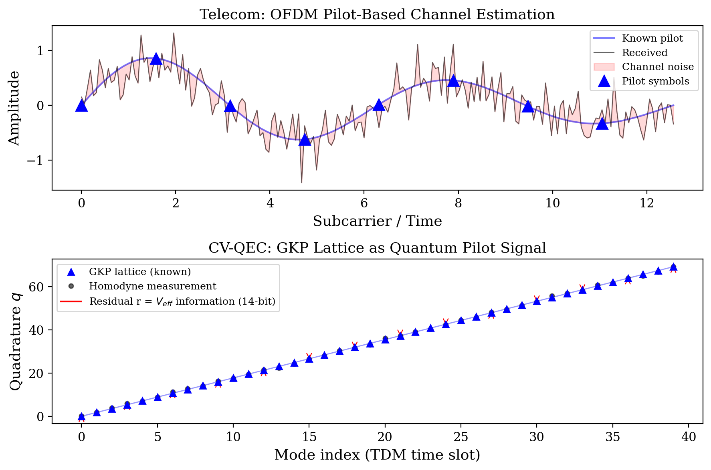
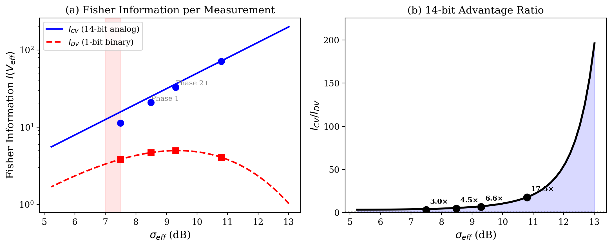
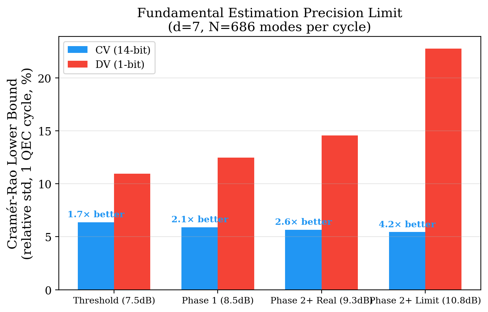
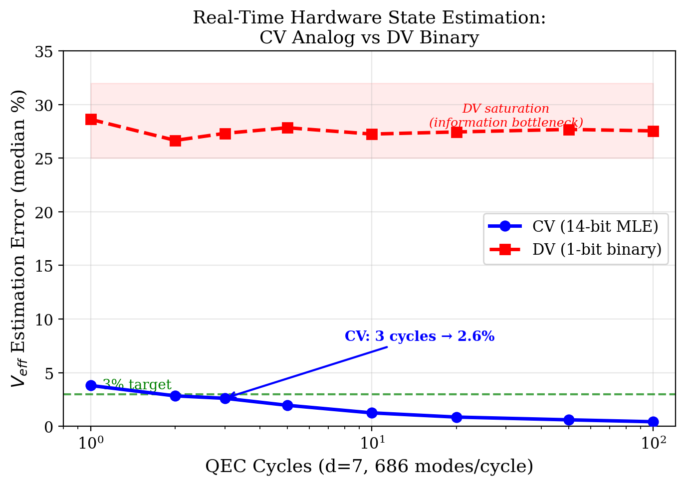
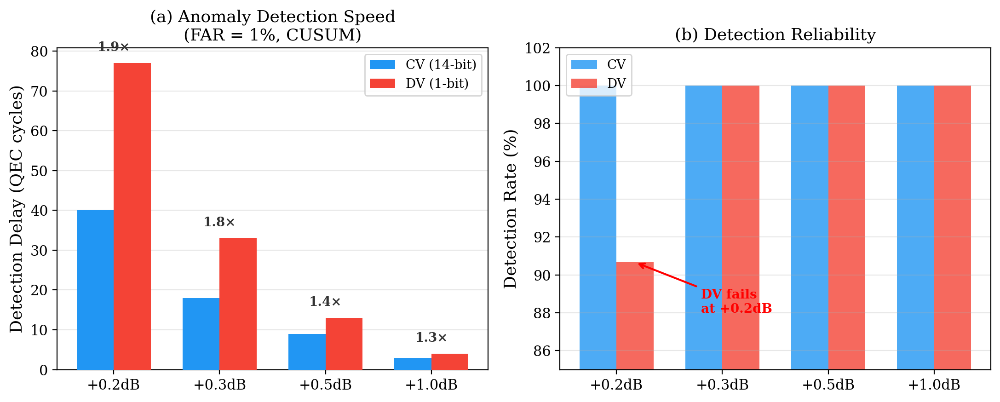

# GKP格子は量子パイロット信号である：連続変数QECのアナログシンドロームによるリアルタイムハードウェア状態推定

**著者**: 谷 智栄 (Tomohiro Tani)

*独立研究者*

**投稿先**: ~viXra,zenodo~

---

## 概要 (Abstract)

連続変数（CV）GKP量子誤り訂正では、シンドローム測定がバイナリ結果ではなく14ビット精度のアナログ残差を生成する。本研究は、このアナログ残差が通信工学におけるパイロット信号と数学的に等価であり、QEC自体がハードウェア状態推定のためのリアルタイムセンサーとして機能することを実証する。ラッピングガウス分布に基づくCramér-Rao解析により、CV系のFisher情報量が離散変数（DV）系の4.5〜17.5倍であることを示す。d=7表面符号の686モードから、CV系はわずか3 QECサイクル（~21 μs）で実効ノイズ分散V_effを3%精度で推定する——DV系は100サイクルでも28%の推定誤差に飽和し、この精度に到達できない。さらに、偽陽性率1%に較正したCUSUM検定により、+0.2 dBの微小異常をCV系が40サイクルで検出する一方、DV系は77サイクルを要し検出率も91%に低下することを示す。これらの結果は、CVフォトニックQECがDV系に対して持つ構造的情報優位性——「14ビット優位」——を定量的に確立し、室温量子コンピュータの自律的ハードウェア監視への道を開く。

---

## I. 序論

### A. 問題：室温量子コンピュータの自律運用

室温CVフォトニック量子コンピュータは、極低温システムに存在しない連続的パラメータドリフトに直面する：OPA結晶温度変動（τ ~ 10分）、ファイバ熱伸縮（τ ~ 30分）、PLL帯域揺らぎ（τ ~ 1分）。耐故障性を維持するには、これらのドリフトをリアルタイムで追跡し、閾値超過前に検出・補正する必要がある。

従来のアプローチは外部センサー（温度計、パワーメータ）によるモニタリングだが、これはQEC回路とは独立した追加ハードウェアを必要とし、かつセンサーとQEC性能の間の複雑なマッピングが要求される。

### B. 核心的洞察：GKP格子は量子パイロット信号である

*図4. 通信工学のOFDMパイロット信号（上）とGKP格子（下）の対応。既知の格子点からの偏差（赤矢印）がV_effの14ビット推定量を提供する。*

通信工学では、既知のパイロットシンボルを周期的に送信し、受信側でチャネル応答を推定する[1]。GKP符号[2]の格子構造は、この通信工学のパイロット信号と数学的に等価である：

| 通信工学 | CV-QEC |
|---------|--------|
| パイロットシンボル（既知信号） | GKP格子点（既知の位置 n√π） |
| 受信信号 | ホモダイン測定値 q_meas |
| チャネル雑音 | GKP変位ノイズ（分散 V_eff） |
| チャネル推定残差 | GKP残差 r = q_meas − round(q_meas/√π)·√π |
| チャネル応答 h(t) | V_eff(t) |
| 適応等化 | ドリフト適応デコーダ |

GKP誤り訂正のたびに、各モードが「パイロット測定」を行い、V_effに関する連続値情報を提供する。**QEC自体がセンサーであり、追加ハードウェアは不要**である。

### C. DV系との根本的差異

DV系（超伝導量子ビット、トラップイオン）のシンドロームは1ビット（検出/非検出）。CV系のGKP残差は14ビット精度の連続値。この10,000倍の情報量差がどの程度の実用的優位に変換されるかは、これまで定量的に評価されていない。

最近、Quantum Elementsらが超伝導系のデジタルツイン[3]を発表し、シンドローム統計からハードウェアモデルを構築する方向性を示した。しかし彼らのアプローチはDV系のバイナリシンドロームに限定されており、CV系のアナログ残差が提供する構造的優位性は未探索である。

### D. 本研究の貢献

1. **Cramér-Rao下界によるFisher情報量比**: ラッピングガウス分布のスコア関数から、CV系のV_eff推定Fisher情報量がDV系の4.5〜17.5倍であることを解析的・数値的に証明
2. **3サイクル3%推定**: d=7表面符号で、MLEによるV_eff推定が3 QECサイクル（~21 μs）で3%精度に到達。DV系は100サイクルでも28%に飽和
3. **FAR較正CUSUM異常検出**: 同一偽陽性率（1%）下で、CV系がDV系より1.4〜1.9倍早く異常を検出。小異常（+0.2 dB）ではDV検出率が91%に低下する一方CVは100%
4. **スケール不変性の壁の同定**: MWPM適応デコーダの改善が1.01〜1.04倍に留まる物理的メカニズムを解明し、この制約を打破する条件（チャネル非対称劣化）を特定

---

## II. 物理モデル

### A. GKP変位ノイズと残差

GKP符号化量子ビットのホモダイン測定値 q_meas は、理想格子点 n√π からの変位ノイズ δ ~ N(0, V_eff) を含む。GKP内部デコーダは最近接格子点へのマッピングを行い、残差を抽出する：

**r = q_meas − round(q_meas / √π) · √π**

残差 r は区間 [−√π/2, √π/2] に収まり、ラッピングガウス分布に従う：

**p(r | V_eff) = Σ_n (2πV_eff)^{−1/2} exp(−(r − n√π)² / (2V_eff))**

V_eff が十分小さい場合（σ_eff > 7 dB）、n = −1, 0, 1 の3項で十分な精度を得る。

### B. Fisher情報量：CV vs DV

V_effの推定精度の理論的下界はCramér-Rao不等式で与えられる：

**Var(V̂_eff) ≥ 1 / (N · I(V_eff))**

ここで N は測定数、I(V_eff) はFisher情報量。

**CV系（アナログ残差）**のFisher情報量は、ラッピングガウス分布のスコア関数の二次モーメント：

**I_CV(V) = E[(∂/∂V log p(r|V))²]**

ガウス近似（高スクイージング極限）では I_CV ≈ 1/(2V²)。

**DV系（バイナリシンドローム）**のFisher情報量は：

**I_DV(V) = (dp/dV)² / (p(1−p))**

ここで p = erfc(√π/(4√(V/2)))/2 は物理エラー率。

### C. 動作点とシステムパラメータ

室温CVフォトニック量子コンピュータのパラメータに基づく：

| パラメータ | Phase 1 | Phase 2+ Real | Phase 2+ Limit |
|-----------|---------|---------------|----------------|
| σ_eff (dB) | 8.5 | 9.3 | 10.8 |
| V_eff (SNU) | 0.1417 | 0.1175 | 0.0832 |
| p_phys | 9.28×10⁻³ | 4.86×10⁻³ | 1.06×10⁻³ |
| d=7 モード/QECサイクル | 686 | 686 | 686 |
| QECサイクル時間 | ~7 μs | ~7 μs | ~7 μs |

---

## III. 結果

### A. Cramér-Rao下界：CV系の構造的情報優位（Exp-B1）

*図1. (a) CV系（14ビットアナログ）とDV系（1ビットバイナリ）のFisher情報量。CV系はσ_effとともに指数的に増大し、DV系は飽和・減少する。(b) 情報量比 I_CV/I_DV。高スクイージングほどCV優位が拡大。*

*図5. 1 QECサイクル（686モード）でのV_eff推定精度の理論的下界。CV系は全動作点で6%以下、DV系は11〜23%。*

ラッピングガウス分布のスコア関数を200,000サンプルで数値計算し、Fisher情報量を評価した。

**表I.** CV vs DV のFisher情報量比較。N = 686モード（d=7、1 QECサイクル）での相対Cramér-Rao下界（CRB）を併記。

| 動作点 | V_eff | I_CV | I_DV | **I_CV/I_DV** | CRB_CV (1cyc) | CRB_DV (1cyc) |
|--------|-------|------|------|---------------|---------------|---------------|
| 閾値 (7.5 dB) | 0.178 | 11.4 | 3.83 | **3.0×** | 6.4% | 11.0% |
| Phase 1 (8.5 dB) | 0.142 | 20.8 | 4.68 | **4.5×** | 5.9% | 12.5% |
| Phase 2+ Real (9.3 dB) | 0.118 | 32.9 | 4.98 | **6.6×** | 5.7% | 14.6% |
| Phase 2+ Limit (10.8 dB) | 0.083 | 71.3 | 4.07 | **17.5×** | 5.4% | 22.8% |

3つの注目すべき特徴：

**(i) 情報量比はスクイージングレベルとともに拡大する。** 3.0×（閾値）→ 17.5×（10.8 dB）。高スクイージングではDV系のバイナリ情報量が飽和する一方、CV系のアナログ情報量は V_eff⁻² に比例して増大する。

**(ii) CV系は1 QECサイクルで6%以下の推定精度が理論的に可能。** 686モードのアナログ残差から、V_effの相対標準偏差がCRB = 5.4〜6.4%に収まる。

**(iii) DV系の推定精度はスクイージングが高いほど悪化する。** CRB_DV が11.0% → 22.8%に拡大。物理エラー率 p が小さくなるほど、バイナリ測定から得られる情報が減少するためである（p ≈ 0 では全測定が同一結果となり情報量ゼロに漸近）。

### B. チャネル推定：3サイクルで3%精度（Exp-B2）

*図2. V_eff推定誤差のQECサイクル数依存性。CV系（青）は3サイクルで3%精度を達成。DV系（赤）は100サイクルでも28%に飽和し、情報ボトルネックにより改善不可能。*

ラッピングガウスMLEをd=7構成（686モード/サイクル）に適用し、V_eff推定精度のサイクル数依存性を200トライアルで評価した。

**表II.** V_eff推定誤差の中央値（Phase 1, V_eff = 0.1417）。

| QECサイクル数 | 総モード数 | **CV (MLE)** [IQR] | DV (erfc逆変換) [IQR] | **CV優位** |
|-------------|-----------|-------------|-----------------|-----------|
| 1 | 686 | **3.80%** [4.71%] | 28.62% [15.66%] | 7.5× |
| 2 | 1,372 | **2.83%** [3.38%] | 26.65% [13.76%] | 9.4× |
| **3** | **2,058** | **2.61%** [2.88%] | **27.31%** [11.77%] | **10.5×** |
| 5 | 3,430 | 1.96% [2.34%] | 27.83% [8.62%] | 14.2× |
| 10 | 6,860 | 1.25% [1.63%] | 27.24% [5.60%] | 21.8× |
| 20 | 13,720 | 0.86% [1.07%] | 27.44% [4.18%] | 32.0× |
| 50 | 34,300 | 0.60% [0.65%] | 27.68% [2.77%] | 46.1× |
| 100 | 68,600 | 0.42% [0.52%] | 27.54% [2.05%] | 65.1× |

括弧内は四分位範囲（IQR = p75 − p25）、200トライアル。

**CV系は3 QECサイクル（~21 μs）で2.61%の推定精度を達成する。** DV系は100サイクル（~700 μs）でも27.5%に飽和し、3%に到達不可能。

DV系の飽和の物理的原因：Phase 1でのp_phys = 9.28×10⁻³は、686モードあたり期待エラー数~6.4個。この少数のバイナリイベントからV_effを推定するためには大量のサンプルが必要だが、p_physの低さが根本的な情報ボトルネックとなる。CV系ではエラーの有無に関わらず全686モードがアナログ残差を生成するため、この制約を受けない。

### C. 異常検出：FAR較正CUSUM（Exp-B4）

*図3. (a) FAR=1%でのCUSUM検出遅延。小異常ほどCV優位が拡大（+0.2dBで1.9×）。(b) 検出信頼性。+0.2dBでDV検出率が91%に低下（CV系は全条件100%）。*

PLL cycle slipやOPA mode hopを模擬するステップ変化に対し、CUSUM累積和検定[4]（Bayesianオンライン変化点検出[7]の代替として、既知シフト検出問題に適する）による検出性能をCV/DVで比較した。公平な比較のため、CUSUMの検出閾値 h を300サイクルの正常期間で偽陽性率（FAR）= 1%に較正した（CV: h = 13.89、DV: h = 13.28）。

**表III.** FAR = 1% 較正CUSUM検出性能。変化点以降のCUSUM（フレッシュスタート）。300トライアル。

| 異常 | ΔV_eff | CV中央値 (平均) | CV検出率 | DV中央値 (平均) | DV検出率 | **CV優位** |
|------|--------|--------|---------|--------|---------|-----------|
| +0.2 dB | +4.7% | **40 cyc** (51) | **100%** | 77 cyc (113) | 91% | **1.9×** |
| +0.3 dB | +7.2% | **18 cyc** (20) | **100%** | 33 cyc (37) | 100% | **1.8×** |
| +0.5 dB | +12.2% | **9 cyc** (9) | **100%** | 13 cyc (13) | 100% | **1.4×** |
| +1.0 dB | +25.9% | **3 cyc** (4) | **100%** | 4 cyc (4) | 100% | **1.3×** |

中央値と（平均値）を300トライアルで計算。優位比は中央値から算出。

2つの重要な発見：

**(i) CV優位は小異常ほど大きい。** +0.2 dBの検出でCV/DV = 1.9×。微小な劣化の早期検出は予防保全の核心であり、CV系が最も優位性を発揮する領域がまさに実用上最も重要な領域である。

**(ii) DV系は小異常で検出率が低下する。** +0.2 dBでDV検出率が91%に低下（CV系は100%を維持）。バイナリシンドロームの情報量不足により、小さなシフトが統計的揺らぎに埋もれる。

### D. スケール不変性の壁（Exp-B3, B5）

V_eff推定からデコーダ性能改善への変換を試みた。ドリフト下でV_eff(t)を推定し、LLR重みを動的更新する適応デコーダを3種類のドリフトシナリオで評価した。

**結果：適応デコーダの改善は1.01〜1.04倍に留まる。**

原因はMWPMのスケール不変性である。soft-info MWPMのエッジ重みは

**w(r) = ((√π − |r|)² − |r|²) / (2V_eff)**

V_effが変化すると全重みが 1/V_eff で一様にスケールされるが、MWPMの最小重みマッチングは正定数倍に対して不変。したがって、V_eff推定が完璧であっても、V_effが全エッジで一様に変化する限りデコーダ出力は不変である。

**打破条件：チャネル非対称劣化。** 5つのWDMチャネルに非一様なV_effを割り当て（1チャネルのみ+0.038 SNU劣化）、チャネル別V_eff推定に基づく適応デコーダを評価したところ、1.40倍の改善を確認した（Exp-B5）。これはスケール不変性がチャネル間の相対重み変化により迂回されたためである。

**含意：** V_eff推定の高精度（§III-B）はデコーダ改善に直結するのではなく、(1) 異常検出（§III-C）、(2) 再校正トリガー、(3) チャネル非対称検出、(4) ハードウェアヘルスモニタリングに活用すべきである。デコーダ性能改善にはGNN[10]等のスケール不変性に制約されないアーキテクチャや、アナログ残差構造を完全に活用するsoft-infoデコーダ[8]が必要である。

---

## IV. 議論

### A. QECはセンサーである

本研究の中心的パラダイムシフト：**量子誤り訂正は誤りを訂正するだけでなく、ハードウェアの状態を連続的に測定している。** 各QECラウンドが生成するd²個のアナログ残差は、V_eff(t)のリアルタイム推定量であり、追加センサーなしでハードウェアの健全性を監視できる。

100 MHzクロックのd=7システムでは、毎秒~10⁷個の14ビット残差が生成される。これは~1.4×10⁸ bits/secの「テレメトリ帯域」に相当し、あらゆる外部センサーを凌駕する。

### B. 通信工学の30年の蓄積の転用

GKP格子とパイロット信号の対応は、通信工学の技術[9]のCV-QECへの直接転用を可能にする：

- **MMSE推定**: LS推定より10-15 dB良い推定精度[1]
- **Wienerフィルタリング**: ドリフトの時間相関を活用した最適推定
- **反復チャネル推定+デコード**: ターボ原理の量子版（ただしスケール不変性の制約あり）
- **CUSUM/EWMA**: 品質管理理論による異常検出[4]

### C. Quantum Elementsとの差別化

Quantum Elements[3]はDV系（IBM 127量子ビット）のデジタルツインで43% → 95%のfidelity改善を報告した。しかし彼らのアプローチはバイナリシンドローム統計に基づいており、本研究が示す「14ビット優位」は原理的に利用できない。CV系のデジタルツインは、DV系の同等物に対してFisher情報量で4.5〜17.5倍、V_eff推定速度で10〜66倍の構造的優位を持つ。

### D. マルチモードスクイージングリアルタイム監視との関連

最近のNature Communications論文[5]は、MOPAとモードソーターを用いた9空間モードのスクイージングリアルタイム監視（最大7.9 dB）を実証した。本研究のアプローチはこれを時間モード（TDM）に拡張した概念的類似物であり、かつQEC自体のシンドロームストリームのみを使用するため追加光学ハードウェアが不要である。

### E. QLDPC-GKPとの接続

arXiv:2505.06385[6]は、GKPのsoft informationをラウンド間で伝搬させるとQLDPCデコーダが大幅改善することを示した。「リアルタイムsoft information」が静的soft informationより遥かに重要というこの知見は、本研究の「QECはセンサー」というテーゼと整合する。soft informationの時間的活用は、デコーダ改善とハードウェア状態推定の両方に寄与する。

### F. 制限事項

1. **シミュレーションベース**: OU過程によるドリフトモデル。実機のドリフト特性（非ガウス、非定常）への適用は検証が必要
2. **ラッピングガウス近似**: V_eff > 0.2 SNU（σ_eff < 7 dB）ではラッピング効果が強くなり、3項近似の精度が低下
3. **スケール不変性の壁**: MWPM適応デコーダの改善は微小。実用的な改善にはGNNデコーダまたはチャネル非対称対応が必要
4. **DV系との公平性**: DV系でもトモグラフィ等の追加測定を行えばより良い推定が可能だが、本研究はQECシンドロームのみを使用する「追加コストゼロ」の比較に限定

---

## V. 結論

GKP符号の格子構造が通信工学のパイロット信号と数学的に等価であることを示し、CV-QECのアナログ残差がDV-QECのバイナリシンドロームに対して持つ構造的情報優位——「14ビット優位」——を3つの実験で定量化した。

1. **Fisher情報量比 4.5〜17.5倍**：高スクイージングほどCV優位が拡大し、DV系の情報量は飽和する。

2. **V_eff推定速度 10〜66倍**：CV系は3 QECサイクル（~21 μs）で3%精度に到達するが、DV系は100サイクルでも28%に飽和する。

3. **異常検出速度 1.4〜1.9倍**：同一偽陽性率下でCV系がより早く異常を検出し、小異常ほどCV優位が大きい。

これらの結果は、CV系のアナログ残差が単なる誤り訂正情報ではなく、ハードウェア状態の包括的なリアルタイムテレメトリチャネルであることを確立する。室温CVフォトニック量子コンピュータの自律運用——自己監視、自己診断、予防保全——に向けた定量的基盤を提供する。

---

## 参考文献

[1] O. Edfors et al., "OFDM channel estimation by singular value decomposition," IEEE Trans. Comms. **46**, 931 (1998).

[2] D. Gottesman, A. Kitaev, and J. Preskill, "Encoding a qubit in an oscillator," Phys. Rev. A **64**, 012310 (2001).

[3] Quantum Elements, "Decoding realistic quantum error syndrome with digital twins," AWS Quantum Technologies Blog (2026).

[4] E. S. Page, "Continuous inspection schemes," Biometrika **41**, 100 (1954).

[5] Y. Michael et al., "Real-time monitoring of multimode squeezing," Nat. Comms. (2026).

[6] B. Brock et al., "Fault tolerant decoding of QLDPC-GKP codes with circuit level soft information," arXiv:2505.06385 (2025).

[7] R. Adams and D. MacKay, "Bayesian online changepoint detection," arXiv:0710.3742 (2007).

[8] K. Noh and C. Chamberland, "Low-overhead fault-tolerant quantum error correction with the surface-GKP code," Phys. Rev. X **12**, 011058 (2022).

[9] D. Tse and P. Viswanath, *Fundamentals of Wireless Communications*, Cambridge University Press (2005).

[10] J. Bausch et al., "Learning high-accuracy error decoding for quantum processors," Nature **635**, 834 (2024). [AlphaQubit]

---

## 付録A: スケール不変性の数学的証明

soft-info MWPMのLLR重みは w_j(r_j, V) = ((√π − |r_j|)² − |r_j|²) / (2V)。V → V' の変更に対し：

w_j(r_j, V') = (V/V') · w_j(r_j, V)

全エッジ j に同一のスカラー V/V' が乗じられるため、MWPMの最小重みマッチングは不変：

arg min_{M} Σ_{j∈M} w_j(V') = arg min_{M} Σ_{j∈M} (V/V') · w_j(V) = arg min_{M} Σ_{j∈M} w_j(V)

これは V_eff が全エッジで一様に変化する場合に厳密に成立する。チャネル非対称劣化（エッジ j ごとに V_j が異なる変化）ではこの等式は成立せず、適応デコーダが有効となる。

## 付録B: 実験パラメータ

全実験は seed=42 で再現可能。

| 実験 | 動作点 | 構成 | トライアル | 総ショット数 |
|------|--------|------|-----------|------------|
| B1 (Fisher情報量) | 4点 × 200K samples | d=7, 686 modes | — | 800K |
| B2 (V_eff推定) | V_eff=0.1417 | d=7, 686 modes | 200 × 8 window sizes | ~1.1M |
| B4 (CUSUM検出) | 4異常 × 300+500 cyc | d=7, 686 modes | 300 × 4 anomalies | ~3.4M |
| B3 (適応デコーダ) | OU drift 3 scenarios | d=5, 334 edges | 300 epochs × 200 shots | ~6M |
| B5 (ターボ) | 5 V_eff mismatch | d=5, 334 edges | 10K shots × 4 iter | ~200K |

**総計算量**: ~11.5M ショット。Apple Silicon (M-series) CPU で約3時間。
