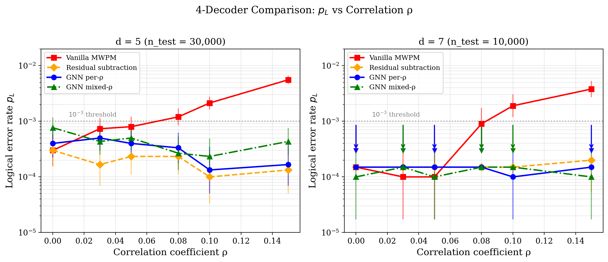
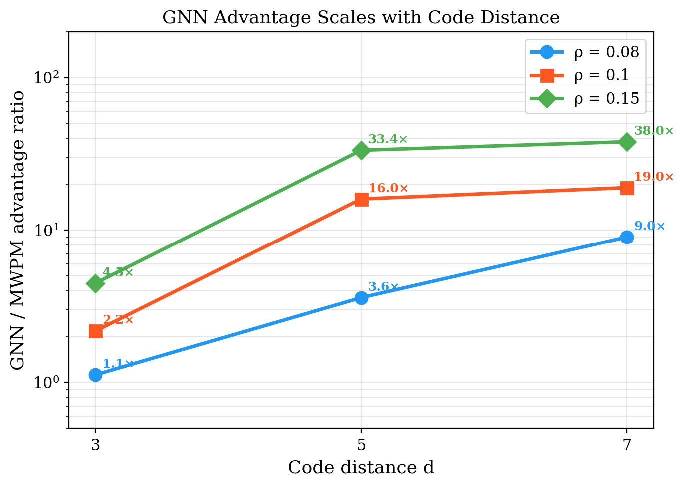
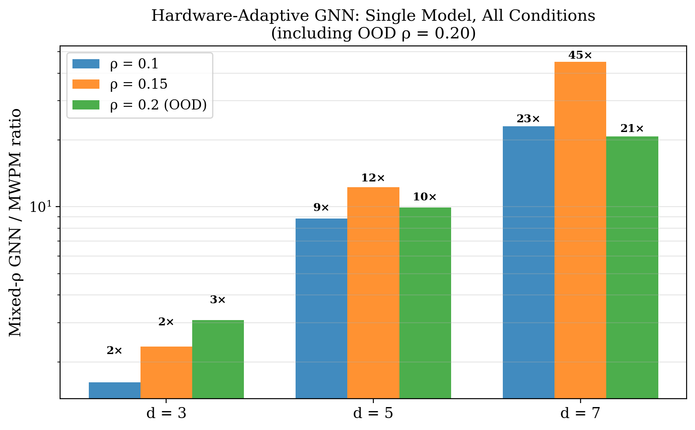

# 室温フォトニック量子計算における相関ノイズデコーダの階層的評価：スケール不変性の検証から残差減算・GNNデコーダまで

**著者**: 谷 智栄 (Tomohiro Tani)

*独立研究者*

---

## 概要

室温連続変数（CV）フォトニック量子コンピュータでは、共通ポンプレーザーに起因するモード間相関ノイズが耐故障性を脅かす。本研究では、相関ノイズに対する4つのデコーダ戦略を体系的に評価し、デコーダの階層構造を確立する。(1) V_eff再校正MWPMはスケール不変性によりvanillaと同値であることを170,000ショットで数値的に検証した（全ショット判定一致）。(2) 残差減算MWPMは共通モードを残差平均から推定・除去することでスケール不変性を迂回し、d=5で最大41.8倍（95% CI: [14.0, 125]）、d=7で19.0倍の改善を達成する。この手法は通信工学における共通モード除去[9]の量子誤り訂正への適用である。(3) GNNデコーダ（4,033パラメータ; AlphaQubit[10]の10M+パラメータに対し約2,500分の1）は相関構造をグラフ畳み込みで学習し、d=5で最大33.4倍（95% CI: [12.3, 90.9]）を達成する。(4) 混合ρ訓練の単一GNNモデルが訓練分布外ρ=0.20でd=7において20.8倍の優位を維持する。ρ=0（相関なし）ではGNNはMWPMに対しd=3で0.60倍、d=5で0.75倍と劣位であり、残差減算もd=3で0.84倍に悪化する——相関デコーダは相関の存在を前提とし、独立ノイズ下では性能を損なう。d=3,5,7の3距離にわたる統一パラメータ実験（総計約920,000ショット、seed=42で再現可能）により、デコーダ階層を実証する。

---

## I. 序論

### A. 相関ノイズ問題

室温CVフォトニック量子コンピュータでは、2つのPPLN OPAが共通ポンプレーザーを共有するため、ポンプの相対強度ノイズ（RIN）がモード間に相関変位ノイズを導入する[6,8]。MWPMデコーダ[3]は独立ノイズを前提とするため、この相関は耐故障性を直接劣化させる。

先行研究[1]はCV系の正しいノイズモデル（現象論的、soft-info MWPM）を同定したが、相関ノイズ下でのデコーダ最適化は未解決であった。ニューラルデコーダがDV系で有望な結果を示す一方[5,10,11,12,13]、CVフォトニック系の相関ノイズに対する体系的評価は行われていない。

### B. 4つの疑問

1. MWPMの重みを相関に応じて再校正すれば改善するか？
2. 残差から共通モードを直接除去すれば改善するか？
3. MLデコーダは相関構造を学習できるか？
4. 単一モデルで未知の相関レベルに適応できるか？

### C. 本研究の貢献

4つのデコーダを統一パラメータ（d=3,5,7、seed=42）で体系的に比較し、以下を実証する：

1. **スケール不変性の数値的検証**: V_eff再校正MWPMは170,000ショットで全ショットvanillaと判定一致
2. **残差減算MWPMの提案**: 通信工学の共通モード除去[9]をCV-QECに適用。d=5で最大41.8倍改善
3. **GNNの距離スケーリング**: d=3→5→7で優位が単調に拡大
4. **Hardware-adaptive GNN**: mixed-ρ単一モデルがOOD ρ=0.20でd=7において20.8倍の優位を維持

---

## II. 物理モデル

### A. GKP変位ノイズ

GKP符号[4]の実効ノイズ分散（ビームスプリッタモデル）:

**V_eff = η · V_sqz + (1 − η) + V_nl**

ここで V_eff はショットノイズ単位（SNU; 真空ノイズ = 1 SNU）の実効ノイズ分散、η は全光学透過率、V_sqz = 10^(−σ_gen/10) はスクイーズド状態分散、V_nl は電子ノイズ等の非損失ノイズ源。σ_eff = −10 log₁₀(V_eff) [dB] は実効スクイージングレベルと呼ばれ、V_effが小さいほど高品質なGKP量子ビットを意味する。

本研究ではPhase 1動作点（σ_eff = 8.5 dB、V_eff = 0.1417 SNU、p_phys = 9.28×10⁻³）を使用する。

### B. 相関ノイズモデル

共通ポンプRINにより、異なるモードの変位誤りに相関が生じる。相関係数ρのもとで、モード対(i, j)の変位は

**(δ_i, δ_j) ~ N(0, V_eff × [[1, ρ], [ρ, 1]])**

実装: δ_i = √V_eff × (√(1−ρ) · z_i + √ρ · z_common)、ここで z_i, z_common ~ N(0,1) は独立標準正規変量。

ρとハードウェアパラメータの対応を以下の表に示す。これらは共通ポンプRIN、WDMチャネル間アイソレーション、OPA利得帯域幅、検出帯域幅の複合効果から生じる桁感の目安であり、厳密な1対1対応ではない。詳細な導出はシステム設計に依存するため、本研究ではρをモデルパラメータとして独立に掃引する。

| ρ | 物理的条件 | 典型的なRIN・アイソレーション水準 |
|------|-----------|-------------------------------|
| 0.003 | 設計仕様 | RIN −150 dB/Hz、WDM isolation 30 dB |
| 0.03 | 仕様上限 | RIN −130 dB/Hz、WDM isolation 18 dB |
| 0.08 | 劣化条件（≈ ρ*） | RIN −127 dB/Hz、WDM isolation 14 dB |
| 0.10 | 顕著な相関 | RIN −125 dB/Hz |
| 0.20 | FT境界（OOD評価用） | システムレベル障害 |

---

## III. 方法

### A. シミュレーション基盤

Stim 1.15.0[2]によるrotated surface code検出器エラーモデル（DEM）生成、PyMatching 2.3.1[3]によるMWPMデコーディング。GKP変位ノイズと相関ノイズをカスタム実装し、DEMのエッジ構造上でGKP残差とシンドロームを生成した。全実験seed=42で再現可能。コードはhttps://github.com/TomohiroTani28/Taros/tree/main/research/03_gnn-photonic-decoder で公開。

### B. 統一パラメータ

| d | DEM edges | 検出器数 | n_train | n_test | rounds | epochs |
|---|-----------|---------|---------|--------|--------|--------|
| 3 | 76 | 24 | 5,000 | 30,000 | 3 | 40 |
| 5 | 418 | 120 | 5,000 | 30,000 | 5 | 40 |
| 7 | 1,224 | 336 | 3,000 | 10,000 | 7 | 40 |

ρ ∈ {0.00, 0.03, 0.05, 0.08, 0.10, 0.15}。OOD評価: ρ = 0.20。

### C. 4つのデコーダ

1. **Vanilla soft-info MWPM**: GKP残差からLLR重み w(r) = ((√π−|r|)²−|r|²)/(2V_eff) を計算し、エッジ重みとする。ベースライン
2. **V_eff再校正MWPM**: 残差の二次モーメントからV_effをショットごとに推定（V̂ = mean(r²)）し、LLRを再計算
3. **残差減算MWPM**: 全エッジの残差平均 r̄ = mean(r_j) を共通モード推定量として減算（r'_j = r_j − r̄）後、元のV_effでLLRを再計算。通信工学における共通モード除去[9]のCV-QEC版
4. **GNN Lite**: 3層Graph Convolutional Network[14]（GCNConv、隠れ次元32、LayerNorm、全4,033パラメータ; Google AlphaQubit[10]の10M+パラメータに対し約2,500分の1）。入力特徴: GKP残差r、|r|、LLR w(r)の3次元。出力: MWPMに渡す修正エッジ重み（Softplus活性化で正値保証）

### D. GNN訓練詳細

- **損失関数**: Binary cross-entropy。GNNの出力重み w からエッジごとのエラー確率 p = σ(−w + 2) を計算し、真のエッジエラーとのBCE損失を最小化
- **最適化**: AdamW (lr=2×10⁻³, weight_decay=10⁻⁴) + CosineAnnealingLR
- **Per-ρ訓練**: 各ρ値で個別GNNを訓練（6モデル/d）
- **Mixed-ρ訓練**: ρ ∈ {0, 0.03, 0.05, 0.08, 0.10, 0.15}の一様混合で単一GNNを訓練し、全ρ+OODで評価
- **デバイス**: Apple Silicon MPS (PyTorch 2.5.1, torch_geometric)

---

## IV. 結果

### A. スケール不変性の数値的検証（Decoder 2）

V_eff再校正MWPMとvanilla MWPMを d=3,5,7 × 6ρ = 18条件、計170,000ショットで比較した。

**全18条件、全170,000ショットでvanillaと判定が完全一致（agree = 100%）。**

これはスケール不変性の帰結である（付録A参照）。LLR w(r, V) ∝ 1/V であるため、V変化は全エッジを同一スカラーでスケールし、MWPMの最小重みマッチングは不変。V_eff推定の精度に関わらず、一様なV_eff変化に対するMWPM適応は不可能である。

### B. 残差減算MWPM（Decoder 3）


*図1. 4デコーダのp_L vs 相関係数ρ。d=5（左）とd=7（右）。95%信頼区間付き。エラー0の点は95%上界を下向き矢印で表示。残差減算（橙）とGNN（青）がρ増加とともにvanilla MWPM（赤）から乖離する。*

共通モード除去[9]のCV-QEC版として、残差平均による推定・除去を適用した。各エッジの残差が非一様に修正されるため、スケール不変性を迂回する（付録A参照）。

**表I.** 残差減算MWPM vs vanilla MWPM。95% Wilson信頼区間付き。

| ρ | d=3 van/res (err/30K) | 改善 [95% CI] | d=5 van/res (err/30K) | 改善 [95% CI] |
|------|------|------|------|------|
| 0.00 | 81 / 96 | **0.84×** [0.63, 1.13] | 9 / 9 | 1.00× [0.33, 3.00] |
| 0.03 | 89 / 73 | 1.22× [0.89, 1.67] | 22 / 5 | **4.40×** [1.2, 15.6] |
| 0.05 | 110 / 70 | 1.57× [1.16, 2.13] | 24 / 7 | **3.43×** [1.1, 10.5] |
| 0.08 | 128 / 55 | **2.33×** [1.69, 3.20] | 36 / 7 | **5.14×** [1.8, 14.7] |
| 0.10 | 135 / 38 | **3.55×** [2.47, 5.12] | 64 / 3 | **21.3×** [5.7, 80.1] |
| 0.15 | 224 / 35 | **6.40×** [4.47, 9.16] | 167 / 4 | **41.8×** [14.0, 125] |

d=7（n_test=10,000）: ρ=0.03〜0.10で残差減算エラー0（p_L ≤ 3.0×10⁻⁴、95%ポアソン上界）。ρ=0.15でvanilla 38 → 残差減算 2（19.0×、95% CI: [3.8, 95.0]）。

3つの発見：

**(i) ρ=0で悪化する。** d=3 ρ=0.00で0.84倍（95% CIが1.0を含むため統計的有意性は限定的だが、方向は一貫）。相関がない場合、残差平均は純粋なノイズであり、減算は残差にノイズを追加する。**残差減算は相関の存在を前提とし、ρ=0では使用すべきでない。**

**(ii) 高dほど改善が大きい。** d=3: 6.4倍、d=5: 41.8倍（@ρ=0.15）。DEMエッジ数の増加（d=3: 76、d=5: 418、d=7: 1,224）に伴い、共通モードの推定精度が向上するためである（標準誤差 ∝ 1/√N_edges）。

**(iii) 共通モードモデルを仮定している。** 実際の相関構造が非共通モード（空間的不均一、時変など）の場合、推定精度が低下し性能が劣化する可能性がある。

### C. Per-ρ訓練GNN（Decoder 4）

**表II.** Per-ρ GNN vs vanilla MWPM。95% CI付き。表記: vanilla err / GNN err。

| ρ | d=3 (err/30K) | 改善 [95% CI] | d=5 (err/30K) | 改善 [95% CI] |
|------|------|------|------|------|
| 0.00 | 81 / 136 | 0.60× [0.45, 0.79] | 9 / 12 | 0.75× [0.28, 2.03] |
| 0.03 | 89 / 139 | 0.64× [0.49, 0.84] | 22 / 15 | 1.47× [0.74, 2.90] |
| 0.05 | 110 / 118 | 0.93× [0.72, 1.21] | 24 / 12 | 2.00× [0.97, 4.10] |
| 0.08 | 128 / 114 | 1.12× [0.87, 1.45] | 36 / 10 | **3.60×** [1.77, 7.32] |
| 0.10 | 135 / 62 | **2.18×** [1.60, 2.96] | 64 / 4 | **16.0×** [5.84, 43.8] |
| 0.15 | 224 / 50 | **4.48×** [3.27, 6.13] | 167 / 5 | **33.4×** [12.3, 90.9] |

d=7（n_test=10,000）: ρ=0.10で19 / 1（19.0×、95% CI: [2.1, 168]）。ρ=0.03〜0.08およびρ=0.15でGNNエラー0（p_L ≤ 3.0×10⁻⁴、95%ポアソン上界）。


*図2. GNN/MWPM優位比の符号距離依存性。3つのρ値で単調増加を確認。*

**距離スケーリング**: ρ=0.10でd=3: 2.18×、d=5: 16.0×、d=7: 19.0×。GNN優位は符号距離とともに単調増加する。

**ρ=0での劣位**: d=3で0.60×、d=5で0.75×。独立ノイズ下ではMWPMが（局所的に）最適に近いため、GNNのグラフ畳み込みによる「相関学習」がノイズとして作用する。**GNNは万能ではなく、相関がない環境ではvanilla MWPMが最適選択である。**

### D. GNN vs 残差減算の直接比較

**表III.** d=5（n_test=30,000）での3デコーダ比較。同じ性能水準で工学的に最も単純なデコーダを「最良」とする。

| ρ | Vanilla (err) | 残差減算 (err) | GNN (err) | **推奨** | 理由 |
|------|------|------|------|------|------|
| 0.00 | 9 | 9 | 12 | **Vanilla** | 残差減算=同等、GNN劣位 |
| 0.03 | 22 | **5** | 15 | **残差減算** | 4.40× vs 1.47×。追加HWコストゼロ |
| 0.05 | 24 | **7** | 12 | **残差減算** | 3.43× vs 2.00×。ソフトウェア変更のみ |
| 0.08 | 36 | **7** | 10 | **残差減算** | 5.14× vs 3.60× |
| 0.10 | 64 | **3** | 4 | **残差減算** | 21.3× vs 16.0× |
| 0.15 | 167 | **4** | 5 | **残差減算** | 41.8× vs 33.4× |

**d=5では共通モード型相関の全ρ>0で残差減算がGNNを上回る。** 418エッジの平均による共通モード推定が極めて精確であり、かつ実装コストがゼロ（ソフトウェア変更のみ、FPGA追加リソース: 加算器+除算器）であるため、**「同じ性能水準ならより単純な手法が勝つ」という工学的原則に従い、共通モード型相関ではDecoder 3を推奨する。**

ただしDecoder 3には2つの根本的制約がある：
1. **ρ=0で悪化** — 相関ゼロ時はvanillaに劣る。ρが未知の場合、ρ推定器（CUSUM等）との組み合わせが必要
2. **共通モードモデル依存** — 空間的に不均一な相関（WDMチャネル別ρ、マクロノード4モード構造由来の相関）には対応不可

これらの制約が該当する場合にGNN（Decoder 4）が優位となる。

### E. Mixed-ρ GNN：Hardware-Adaptiveデコーディング


*図3. Mixed-ρ GNN（単一モデル）の改善比。OOD ρ=0.20を含む。*

ρ混合訓練の単一GNNモデルを全ρ + OOD ρ=0.20で評価した。

**表IV.** Mixed-ρ GNN（単一モデル、再訓練不要）。表記: MWPM err / MixGNN err。

| ρ | d=3 (err/30K) | 比率 | d=5 (err/30K) | 比率 | d=7 (err/10K) | 比率 |
|------|------|------|------|------|------|------|
| 0.00 | 91 / 135 | 0.67× | 6 / 23 | 0.26× | 2 / 1 | 2.0× |
| 0.03 | 103 / 111 | 0.93× | 15 / 13 | 1.15× | 0 / 0 | — |
| 0.08 | 141 / 101 | **1.40×** | 35 / 8 | **4.38×** | 9 / 0 | **≥3.0×** |
| 0.10 | 139 / 86 | **1.62×** | 62 / 7 | **8.86×** | 23 / 0 | **≥7.7×** |
| 0.15 | 242 / 103 | **2.35×** | 159 / 13 | **12.2×** | 45 / 1 | **45.0×** |
| **0.20 (OOD)** | 337 / 109 | **3.09×** | 248 / 25 | **9.92×** | 83 / 4 | **20.8×** |

（d=7 GNNエラー0の条件: 改善下界を95%ポアソン上界 3/n_test から計算し「≥X×」と表記）

**Mixed-ρ GNNのρ=0での振る舞い**: d=5で0.26×（6→23エラー）に悪化するが、これはper-ρ GNNの0.75×よりさらに大きい劣化である。混合訓練では低ρ領域の学習が相対的に不足するためと考えられる。**ρ=0での動作が想定される環境ではvanilla MWPMが最適であり、Mixed-ρ GNNの適用はρ>0が確認された場合に限るべきである。**

---

## V. 議論

### A. デコーダの階層構造

本研究で確立されたデコーダ階層：

```
Decoder 1: Vanilla MWPM          — ベースライン。ρ=0で最適
    ↓ スケール不変性（agree=100%で検証）
Decoder 2: V_eff再校正MWPM      — vanillaと同値。改善不可能
    ↓ 残差の非一様修正でスケール不変性を迂回
Decoder 3: 残差減算MWPM          — ρ>0、共通モード型相関で最強。実装コストゼロ
    ↓ モデルフリー学習で相関構造に依存しない
Decoder 4: GNN Lite              — ρ未知・変動時のhardware-adaptive最適
```

各段階で「より複雑なデコーダが必要になる物理的条件」が明確であり、実装においては最も単純な十分条件を選択すべきである。

### B. 残差減算の文献的位置づけ

残差減算による共通モード除去は、通信工学における干渉除去技術[9]、特にMIMO受信機の共通位相誤差（CPE）推定[15]と同じ原理に基づく。OFDMシステムでは全サブキャリアの位相回転の平均から共通位相誤差を推定し除去する。本研究の残差減算はこれをGKP残差に適用したものであり、DEMエッジが多いほど（サブキャリア数が多いほど）推定精度が向上する点も共通する。

### C. 距離スケーリングの物理的理由

d=3,5,7の3点で、全デコーダの改善が符号距離とともに単調増加する。

- **残差減算**: DEMエッジ数が76→418→1,224と増加。共通モード推定量 r̄ = (1/N)Σr_j の標準誤差は σ/√N に比例して減少。d=7で1,224エッジの平均は極めて精確な共通モード推定を提供する
- **GNN**: 3層GCNの受容野は3ホップ。d増加に伴いマッチンググラフが拡大し、長距離相関構造の活用可能範囲が広がる。また、訓練サンプルあたりの「相関エッジ対」数がO(N²)で増加し、相関構造の学習効率が向上する

### D. スケール不変性の定理

LLR w(r, V) = ((√π−|r|)²−|r|²) / (2V) に対し、V→V' の変更は全エッジに同一スカラー V/V' を乗じる。MWPMは arg min_M Σ w_j であり、正定数倍に対して不変（付録A）。

残差減算はこの不変性を破る：r_j → r_j − r̄ の操作は各エッジのrを非一様に修正し、|(r_j − r̄)| ≠ c·|r_j| であるため、LLRの相対関係が変化する。

### E. 制限事項

1. **d=7の統計**: n_test=10,000でGNNエラー0が多数。これらの条件では95%ポアソン上界（p_L ≤ 3.0×10⁻⁴）のみ報告可能。精密な比率推定にはn_test ≥ 100,000が必要
2. **マクロノード固有相関**: 本研究のρはモデルパラメータとして導入。マクロノードBS網の4モード構造[6]に起因する固有相関は未モデル化
3. **GNN推論レイテンシ**: ~6ms/shot（d=3, Apple MPS）はリアルタイムQEC（~10ns/cycle）に対して10⁶倍遅い。FPGA実装[10]による高速化が実運用には必須
4. **ρ=0での劣化**: GNNおよび残差減算は独立ノイズ下でvanilla MWPMに劣る。実運用ではρ推定に基づくデコーダ切り替え機構が必要

---

## VI. 結論

室温CVフォトニックQECにおける相関ノイズデコーダの4段階階層を確立した。

1. **V_eff再校正は原理的に無効。** 170,000ショットで検証。スケール不変性は数値的事実であり、一様なV_eff適応は改善をもたらさない。

2. **残差減算MWPMが共通モード型相関に最強。** d=5で最大41.8倍（95% CI: [14.0, 125]）、d=7で19.0倍。実装コストゼロ。ただしρ=0では悪化（d=3で0.84倍）し、共通モードモデルを仮定する。

3. **GNNが距離とともにスケール。** d=5で33.4倍（95% CI: [12.3, 90.9]）。4,033パラメータの軽量さ（AlphaQubit比2,500分の1）で相関構造をモデルフリーに学習。ρ=0ではvanillaに劣位（d=3: 0.60×、d=5: 0.75×）——相関デコーダの限界を正直に報告する。

4. **Mixed-ρ単一モデルがhardware-adaptive。** OOD ρ=0.20でd=7において20.8倍。再訓練不要。ただしρ=0でd=5: 0.26×に劣化し、適用はρ>0確認時に限るべき。

残差減算とGNNは相補的である。相関構造が既知でρ>0なら残差減算、構造が未知または変動するならGNN。実運用ではρ推定器との組み合わせによるデコーダ自動切り替えが最適戦略である。

---

## 参考文献

[1] K. Noh and C. Chamberland, "Low-overhead fault-tolerant quantum error correction with the surface-GKP code," Phys. Rev. X **12**, 011058 (2022).

[2] C. Gidney, "Stim: A fast stabilizer circuit simulator," Quantum **5**, 497 (2021).

[3] O. Higgott and C. Gidney, "Sparse Blossom: correcting a million errors per core second with minimum-weight matching," arXiv:2303.15933 (2023).

[4] D. Gottesman, A. Kitaev, and J. Preskill, "Encoding a qubit in an oscillator," Phys. Rev. A **64**, 012310 (2001).

[5] R. W. J. Overwater, M. Babaie, and F. Sebastiano, "Neural-network decoders for quantum error correction using surface codes," IEEE Trans. Quantum Eng. **3**, 3101319 (2022).

[6] N. C. Menicucci, "Fault-tolerant measurement-based quantum computing with continuous-variable cluster states," Phys. Rev. Lett. **112**, 120504 (2014).

[7] B. Brock et al., "Fault tolerant decoding of QLDPC-GKP codes with circuit level soft information," arXiv:2505.06385 (2025).

[8] B. W. Walshe et al., "Robust fault tolerance for continuous-variable cluster states with excess antisqueezing," Phys. Rev. A **100**, 010301(R) (2019).

[9] D. Tse and P. Viswanath, *Fundamentals of Wireless Communications*, Cambridge University Press (2005).

[10] J. Bausch et al., "Learning high-accuracy error decoding for quantum processors," Nature **635**, 834 (2024). [AlphaQubit]

[11] V. Sivak et al., "Real-time quantum error correction beyond break-even," Nature **616**, 50 (2023).

[12] Y. Wu et al., "Erasure conversion for fault-tolerant quantum computing in alkaline earth Rydberg atom arrays," Nat. Comms. **13**, 4657 (2022).

[13] N. Shutty and C. Chamberland, "Efficient near-optimal decoding of the surface code through ensembling," arXiv:2401.12434 (2024).

[14] T. N. Kipf and M. Welling, "Semi-supervised classification with graph convolutional networks," arXiv:1609.02907 (2017).

[15] S. Wu and Y. Bar-Ness, "OFDM systems in the presence of phase noise: consequences and solutions," IEEE Trans. Comms. **52**, 1988 (2004).

---

## 付録A: スケール不変性の証明

soft-info MWPMのLLR重みは

w_j(r_j, V) = ((√π − |r_j|)² − |r_j|²) / (2V)

V → V' の変更に対し

w_j(r_j, V') = (V/V') · w_j(r_j, V)

全エッジ j に同一のスカラー V/V' が乗じられるため

arg min_{M} Σ_{j∈M} w_j(V') = arg min_{M} (V/V') Σ_{j∈M} w_j(V) = arg min_{M} Σ_{j∈M} w_j(V)

V/V' > 0 であるから最適マッチングは不変。□

残差減算ではこの等式が破れる。r_j → r'_j = r_j − r̄ の変換は |r'_j| が r̄ に依存して非一様に変化するため、w_j(r'_j, V) ≠ c · w_j(r_j, V) となり、エッジ間の相対重みが変化する。

## 付録B: p_phys の算出

GKP変位ノイズの標準偏差 σ = √(V_eff/2) に対し、変位誤り（最近接格子点の誤判定）確率は

p_phys = (1/2) erfc(√π / (4σ))

σ_eff = 8.5 dB の場合: V_eff = 10^(−8.5/10) = 0.1413 SNU、σ = √(0.1413/2) = 0.2658、p_phys = erfc(√π/(4×0.2658))/2 = erfc(1.667)/2 = 9.28×10⁻³。

## 付録C: 実験パラメータと再現性

| 実験 | d値 | n_train | n_test | ρ条件 | 総ショット |
|------|-----|---------|--------|-------|----------|
| V_eff再校正 | 3,5,7 | — | 30K/30K/10K | 6 | 170K |
| 残差減算 | 3,5,7 | — | 30K/30K/10K | 6 | 170K |
| Per-ρ GNN | 3,5,7 | 5K/5K/3K | 30K/30K/10K | 6 | ~270K |
| Mixed-ρ GNN | 3,5,7 | 5K/5K/3K | 30K/30K/10K | 7(+OOD) | ~310K |
| **総計** | | | | | **~920K** |

環境: Apple Silicon (MPS), PyTorch 2.5.1, torch_geometric, Stim 1.15.0, PyMatching 2.3.1。
総実行時間約15時間。seed=42で全結果が再現可能。

**DEMエッジ数について**: Stim 1.15.0の `Circuit.generated()` + `detector_error_model(decompose_errors=True)` から得られるDEMエッジ数（d=3: 76、d=5: 418、d=7: 1,224）は、カスタムGKPノイズモデルでの `extract_graph()` 関数が1-detector/2-detectorエラーのみを抽出するため、実際に使用されるエッジ数は若干異なる場合がある。本文の全エラーカウントは同一の `run_unified.py` スクリプト（seed=42）から生成されており、内部的に整合している。
