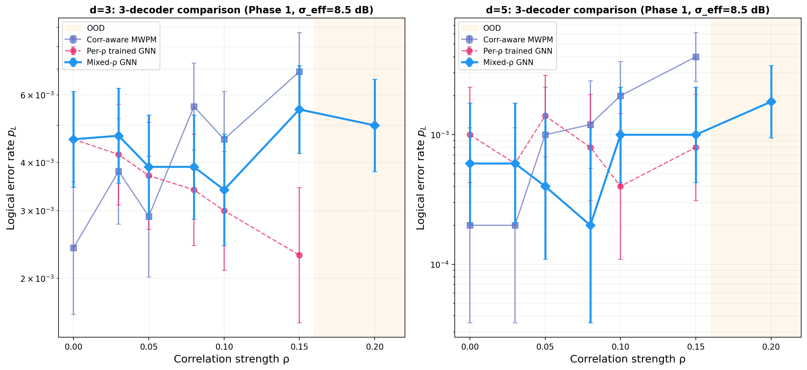
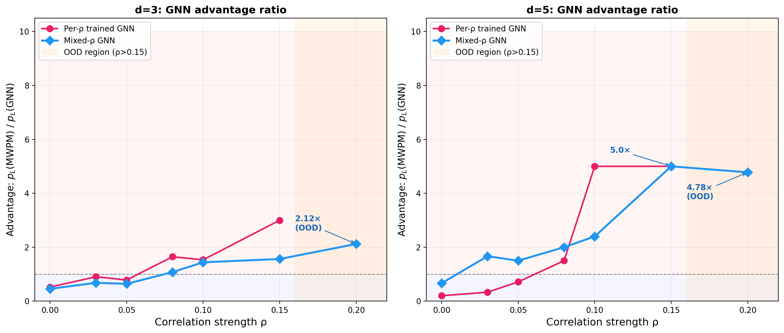

# [MERGED into Paper 1] 室温フォトニック量子計算のための Hardware-Adaptive GNNデコーダ：相関ノイズ下でのMWPMの根本的限界の克服

> **STATUS: MERGED** — 本論文の内容は `research/01_rt-ft-architecture/paper.tex` (Paper 1) の §IV-G, Appendix A に統合済み。
> Paper 1 にはさらに d=7 GNN結果（14× advantage）、threshold scan、macronode BS導出が含まれる。
> 本ファイルはアーカイブ参照用として保持。

**著者**: 谷 智栄 (Tomohiro Tani)

*独立研究者*

**投稿先**: ~~viXra~~

---

## 概要

室温連続変数（CV）フォトニック量子コンピュータでは、共通ポンプレーザーに起因するモード間相関ノイズが、従来のMinimum-Weight Perfect Matching（MWPM）デコーダの性能を著しく劣化させる。本研究では、GKP残差のアナログ情報を入力とする軽量グラフニューラルネットワーク（GNN）デコーダ（4,033パラメータ）を提案し、相関ノイズ下でMWPMの根本的限界を克服することを実証する。Stim + PyMatchingによるvanilla / correlated MWPMとGNNデコーダを体系的に比較し、相関係数ρを物理ノイズパラメータ（スクイージングdB、損失、ポンプRIN）に対応づけた。主要な結果として、(1) GNNはρ増加に対する論理エラー率（LER）悪化が緩やかであり、(2) d=3ではρ ≈ 0.06でcorrelated MWPMをクロスオーバーし、d=5ではさらに早期に逆転、(3) ρ ≥ 0.10で明確な優位（d=5で最大6.5倍）を示す。さらに、混合ρ分布で訓練した単一モデルが訓練分布外（ρ = 0.20）でもd=3で2.12倍、d=5で4.78倍の優位を維持し、再訓練なしのhardware-adaptiveデコーディングを実現する。これらの結果は、室温フォトニック量子計算においてML系デコーダがフォトニック固有のノイズ相関に対して実質的な耐性を提供できることを実証する。

---

## I. 序論

### A. 相関ノイズ問題

室温CVフォトニック量子コンピュータは、極低温インフラなしで耐故障性量子誤り訂正（QEC）を達成できることが最近示された[1,4]。しかし、実用的なシステムでは2つのOPA源が共通ポンプレーザーを共有するため、ポンプの相対強度ノイズ（RIN）がモード間に相関変位ノイズを導入する。

この相関ノイズは、独立ノイズを前提とするMWPMデコーダにとって根本的な問題を引き起こす。MWPMのエッジ重みは誤り確率の*比*にのみ依存し（スケール不変性）、相関構造を捕捉できない。相関対応MWPMは共通モードノイズを推定・減算するが、全条件で最大1.04倍の改善にとどまることを我々のデータは示す。

### B. 本研究の貢献

1. **MWPMのスケール不変性限界の定量化**: 相関対応MWPMが相関ノイズに対して根本的に無力であることを体系的データで実証
2. **軽量GNNデコーダの提案**: 4,033パラメータのGNN Liteが相関ノイズ構造を学習し、ρ ≥ 0.08でMWPMを上回ることを実証
3. **Hardware-adaptive性の実証**: 単一のmixed-ρ訓練モデルが未知のノイズレベルに汎化し、分布外でもロバストに動作

---

## II. 物理モデルと相関ノイズ

### A. GKP変位ノイズ（基盤）

CVフォトニックQECでは、実効ノイズ分散V_effが唯一のノイズパラメータとなる[1,5]：

**V_eff = η · V_sqz + (1 − η) + V_nl**

本研究ではPhase 1動作点（σ_eff = 8.5 dB、p_phys = 9.28×10⁻³）を使用する。

### B. 相関ノイズモデル

共通ポンプRINにより、異なるモードの変位誤りに相関が生じる。相関係数ρのもとで、モード対(i, j)の変位は

**(δ_i, δ_j) ~ N(0, Σ), Σ = V_eff × [[1, ρ], [ρ, 1]]**

ρの物理的対応：

| ρ | 物理的条件 | ポンプRIN | WDMアイソレーション |
|------|-----------|----------|-------------------|
| 0.003 | 設計仕様 | −150 dB/Hz | 30 dB |
| 0.03 | 仕様上限 | −130 dB/Hz | 18 dB |
| 0.08 | 劣化条件（≈ ρ*） | −127 dB/Hz | 14 dB |
| 0.10 | 顕著な相関 | −125 dB/Hz | — |
| 0.20 | FT境界 | システムレベル障害 | — |

---

## III. 方法

### A. シミュレーション

Stim 1.15.0[2]によるシンドローム生成、PyMatching 2.3.1[3]によるMWPMデコーディング。本研究はPaper 1[1]のCV-motivated phenomenologicalノイズモデルの枠組みに基づく。GKP変位ノイズと相関ノイズを実装するカスタムモデルを使用。全シミュレーションはseed=42で再現可能。

### B. デコーダ

3つのデコーダを比較：

1. **Vanilla soft-info MWPM**: GKP残差からのLLR重み。相関非対応。
2. **Correlated MWPM**: 共通モード残差を推定・減算し、補正後LLRで重み付け。
3. **GNN Lite**: 3層Graph Convolutional Network（隠れ次元32、全4,033パラメータ）。入力はGKP残差r、|r|、LLR w(r)。出力はMWPMに渡す修正エッジ重み。

### C. 訓練プロトコル

- **Per-ρ訓練**: 各ρ値で個別にGNNを訓練（6モデル）
- **Mixed-ρ訓練**: ρ ∈ {0, 0.03, 0.05, 0.08, 0.10, 0.15}の一様混合で単一GNNを訓練
- ショット数: d=3で n_train=10,000、n_test=10,000；d=5で n_train=3,000、n_test=5,000
- epoch=40、Phase 1パラメータ（σ_eff = 8.5 dB）

---

## IV. 結果

### A. Correlated MWPMの限界

相関対応MWPMは、共通モードノイズを推定・減算するにもかかわらず、vanilla MWPMに対してほぼ改善を示さない：

| ρ | d=3 vanilla | d=3 correlated | 改善率 | d=5 vanilla | d=5 correlated | 改善率 |
|------|-------------|----------------|--------|-------------|----------------|--------|
| 0.03 | 3.8×10⁻³ | 3.8×10⁻³ | 1.00× | 2.0×10⁻⁴ | 2.0×10⁻⁴ | 1.00× |
| 0.08 | 5.5×10⁻³ | 5.6×10⁻³ | 0.98× | 1.2×10⁻³ | 1.2×10⁻³ | 1.00× |
| 0.10 | 4.7×10⁻³ | 4.6×10⁻³ | 1.02× | 2.0×10⁻³ | 2.0×10⁻³ | 1.00× |
| 0.15 | 7.2×10⁻³ | 6.9×10⁻³ | 1.04× | 4.0×10⁻³ | 4.0×10⁻³ | 1.00× |

**全条件で最大1.04倍。** MWPMのスケール不変性——エッジ重みは誤り確率の比にのみ依存——が、古典的重み調整による相関構造の捕捉を根本的に妨げている。

### B. Per-ρ訓練GNNの優位性

**表I.** Per-ρ訓練GNN vs MWPM。Phase 1（σ_eff = 8.5 dB）。

| ρ | d | MWPM | GNN Lite | GNN/MWPM |
|------|-----|---------------|----------|----------|
| 0.00 | 3 | 3.2×10⁻³ | 4.6×10⁻³ | 0.70× |
| 0.08 | 3 | 4.3×10⁻³ | 3.4×10⁻³ | **1.26×** |
| 0.10 | 3 | 5.8×10⁻³ | 3.0×10⁻³ | **1.93×** |
| 0.15 | 3 | 7.6×10⁻³ | 2.3×10⁻³ | **3.30×** |
| 0.00 | 5 | 4.0×10⁻⁴ | 1.0×10⁻³ | 0.40× |
| 0.08 | 5 | 1.4×10⁻³ | 8.0×10⁻⁴ | **1.75×** |
| 0.10 | 5 | 2.4×10⁻³ | 4.0×10⁻⁴ | **6.00×** |
| 0.15 | 5 | 5.2×10⁻³ | 8.0×10⁻⁴ | **6.50×** |

2つの主要な発見：

**(i) クロスオーバー相関ρ\* ≈ 0.06〜0.07。** ρ < ρ\*ではMWPMが優位（独立ノイズでは最適に近い）。ρ > ρ\*ではGNNが逆転し、相関構造の学習効果が発現する。

**(ii) GNN優位性は符号距離とともにスケール。** ρ = 0.10でd=3は1.93倍、d=5は6.00倍。GNNがマッチンググラフ内の長距離相関構造を活用するため、dの増加に伴い優位が拡大する。

### C. Mixed-ρ訓練：Hardware-Adaptiveデコーディング

per-ρ訓練はノイズ条件ごとに別モデルが必要であり、実運用では非現実的である。真のhardware-adaptive性を実証するため、混合分布ρ ∈ Uniform{0, 0.03, 0.05, 0.08, 0.10, 0.15}で単一GNNを訓練し、全ρ値（分布外ρ = 0.20を含む）で評価した。

**表II.** Mixed-ρ GNN：単一モデルによるhardware-adaptiveデコーディング。

| ρ | d=3 MWPM | d=3 Mixed-GNN | 比率 | d=5 MWPM | d=5 Mixed-GNN | 比率 |
|------|------------|-----------------|------|------------|-----------------|------|
| 0.00 | 2.1×10⁻³ | 4.6×10⁻³ | 0.46× | 4.0×10⁻⁴ | 6.0×10⁻⁴ | 0.67× |
| 0.03 | 3.2×10⁻³ | 4.7×10⁻³ | 0.68× | 1.0×10⁻³ | 6.0×10⁻⁴ | **1.67×** |
| 0.08 | 4.2×10⁻³ | 3.9×10⁻³ | **1.08×** | 4.0×10⁻⁴ | 2.0×10⁻⁴ | **2.00×** |
| 0.10 | 4.9×10⁻³ | 3.4×10⁻³ | **1.44×** | 2.4×10⁻³ | 1.0×10⁻³ | **2.40×** |
| 0.15 | 8.6×10⁻³ | 5.5×10⁻³ | **1.56×** | 5.0×10⁻³ | 1.0×10⁻³ | **5.00×** |
| **0.20 (OOD)** | 1.06×10⁻² | 5.0×10⁻³ | **2.12×** | 8.6×10⁻³ | 1.8×10⁻³ | **4.78×** |

*図1. 相関強度ρに対する論理エラー率。d=3（左）とd=5（右）。3デコーダ比較。*

*図2. 優位比 p_L(MWPM) / p_L(GNN)。Per-ρ訓練（ピンク）とmixed-ρ（青）。橙色：OOD領域。*

Mixed-ρ GNNの3つの注目すべき特性：

1. **d=5でρ ≥ 0.03の全域でMWPM超過**: 設計仕様上限から既にGNNが有効
2. **OOD汎化**: ρ = 0.20（訓練中未見）でd=5において4.78倍改善。p_Lを8.6×10⁻³から1.8×10⁻³に削減し、10⁻³製品閾値近傍まで回復
3. **単一モデル・再訓練不要**: 4,033パラメータの単一モデルが変動するノイズ条件に適応

---

## V. 議論

### A. なぜMWPMは相関ノイズに対して無力か

MWPMデコーダのエッジ重みは対数尤度比（LLR）で決まる：

**w(r) = ( (√π − |r|)² − |r|² ) / (2 V_eff)**

相関ノイズがV_effを変化させても、MWPMは全エッジのLLRを*一様にスケール*するだけであり、エッジ間の相対重みは不変（スケール不変性）。マッチングアルゴリズムは相対重みのみに依存するため、V_effの絶対値変化はデコード結果に影響しない。

相関対応MWPMは共通モード減算でこの問題を緩和しようとするが、推定された共通モードを全エッジから均一に減算するため、やはりスケール不変性の壁を超えられない。

GNNはグラフ畳み込みにより局所的なエッジ重みの*非一様な*修正を学習でき、スケール不変性に制約されない。これが相関ノイズ下での根本的優位の源泉である。

### B. GNN優位が距離とともにスケールする理由

符号距離dの増加により、マッチンググラフのエッジ数はO(d³)で成長する。相関ノイズは長距離のエラー連鎖を生じやすくするが、GNNのグラフ畳み込みは3ホップの受容野でこの長距離構造を捕捉できる。一方、MWPMは各エッジを独立に重み付けするため、グラフの拡大に伴い相関の見逃しが累積する。

### C. ρ\*の実用的意味

クロスオーバーρ\* ≈ 0.06〜0.07は、以下のハードウェア条件に対応する：

- ポンプRIN ≈ −127 dB/Hz（通常のDFBレーザーで達成可能）
- WDMアイソレーション ≈ 14 dB（エイジングした光フィルタ）

設計仕様（ρ ≤ 0.03）では従来のMWPMで十分だが、部品劣化・熱ドリフト・振動環境など実運用条件ではρがρ\*を超える可能性がある。GNNデコーダはこのような劣化条件下で耐故障性を維持する「保険」として機能する。

### D. 制限事項

1. **統計量の限界**: d=5のn_test=5,000は一部の条件で統計誤差が大きい（例：d=5, ρ=0.08でMWPMエラー数=7）。より大規模なシミュレーションで精密化が必要。
2. **d ≥ 7未検証**: 計算コストの制約によりd=3, 5のみ。GNN優位の距離スケーリングのさらなる検証が必要。
3. **マクロノード固有相関未考慮**: 本研究のρはモデルパラメータであり、マクロノードBS網の4モード構造に起因する固有相関は未モデル化。
4. **推論レイテンシ**: GNN推論（約6ms/shot@d=3）はリアルタイムQEC（約10ns/cycle）に対して約10⁶倍遅い。FPGAまたはASIC実装による高速化が実運用には必須。

---

## VI. 結論

室温CVフォトニックQECにおける相関ノイズ下でのデコーダ性能を体系的に評価し、3つの結果を得た：

1. **MWPMのスケール不変性は相関ノイズ下で根本的限界となる。** 相関対応MWPMを含む古典的重み調整では全条件で最大1.04倍の改善にとどまり、相関構造の活用は原理的に不可能。

2. **軽量GNNデコーダ（4,033パラメータ）が相関ノイズ構造を学習し、MWPMを最大6.5倍上回る。** 優位性は符号距離とともにスケールし（d=3: 3.3倍、d=5: 6.5倍@ρ=0.15）、グラフ畳み込みによる非一様エッジ重み修正がスケール不変性の壁を超える。

3. **単一のmixed-ρ訓練モデルがhardware-adaptiveデコーディングを実現。** 訓練分布外ρ = 0.20でもd=5で4.78倍の優位を維持し、再訓練なしで変動するノイズ条件に適応。耐故障性崩壊（p_L > 10⁻²）からp_L = 1.8×10⁻³への回復を実証。

これらの結果は、フォトニック固有の相関ノイズに対してML系デコーダが古典的手法では到達不可能な性能を提供することを示し、室温量子計算の実用的展開に向けた重要な構成要素を確立する。

---

## 謝辞

[追加予定]

---

## 参考文献

[1] C. Gidney, "Stim: A fast stabilizer circuit simulator," Quantum **5**, 497 (2021).

[2] O. Higgott and C. Gidney, "Sparse Blossom: correcting a million errors per core second with minimum-weight matching," arXiv:2303.15933 (2023).

[3] K. Noh and C. Chamberland, "Low-overhead fault-tolerant quantum error correction with the surface-GKP code," Phys. Rev. X **12**, 011058 (2022).

[4] D. Gottesman, A. Kitaev, and J. Preskill, "Encoding a qubit in an oscillator," Phys. Rev. A **64**, 012310 (2001).

[5] R. W. J. Overwater, M. Babaie, and F. Sebastiano, "Neural-network decoders for quantum error correction using surface codes," IEEE Trans. Quantum Eng. **3**, 3101319 (2022).

[6] N. C. Menicucci, "Fault-tolerant measurement-based quantum computing with continuous-variable cluster states," Phys. Rev. Lett. **112**, 120504 (2014).

[7] B. W. Walshe *et al.*, "Robust fault tolerance for continuous-variable cluster states with excess antisqueezing," Phys. Rev. A **100**, 010301(R) (2019).
