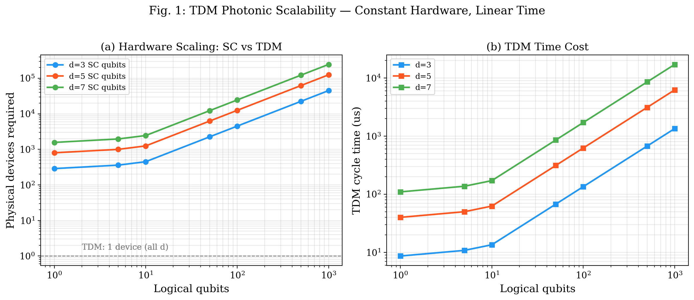
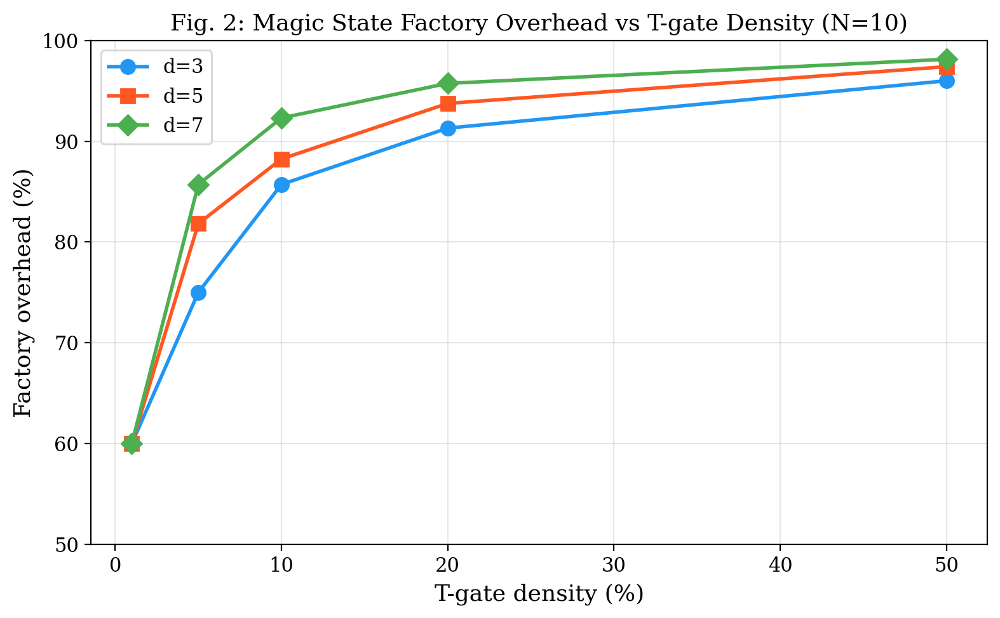
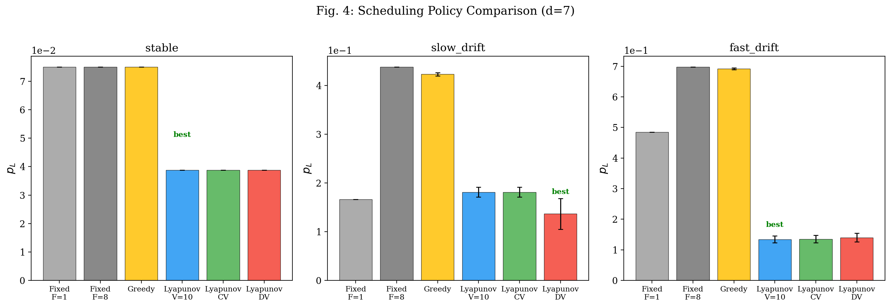
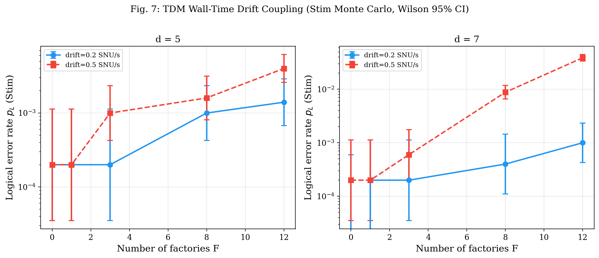
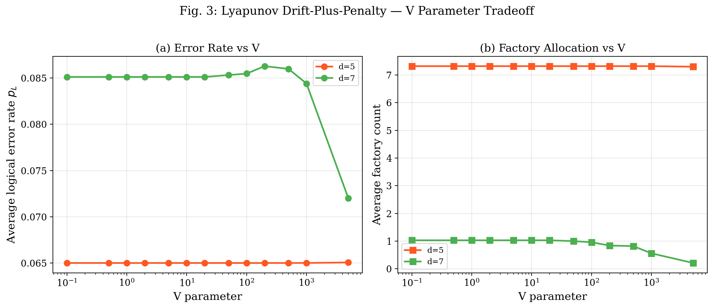
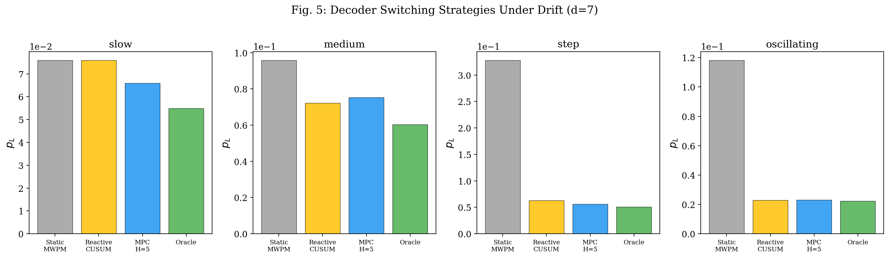
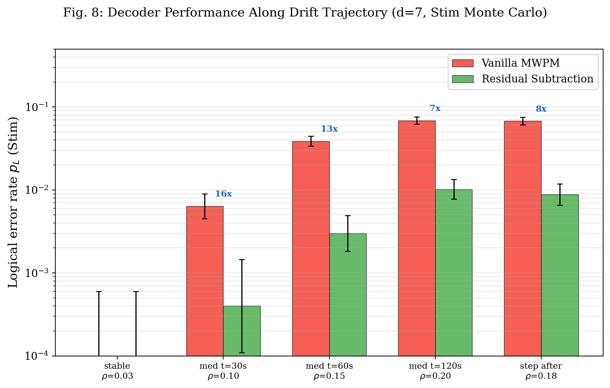
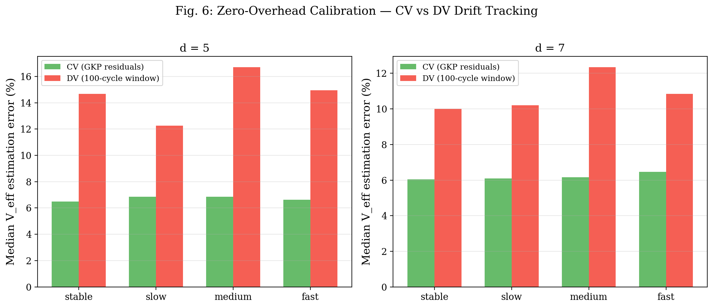

# 量子ネットワークスライシング：時間多重フォトニック量子計算のためのLyapunov最適リソーススケジューリング

**著者**: Tomohiro Tani

*Independent Researcher*

---

## 概要

時間多重（TDM）連続変数（CV）フォトニック量子コンピュータでは、全論理量子ビットが単一の時間パイプラインを共有する。本研究では、このTDM固有のリソーススケジューリング問題を5Gネットワークスライシングとの構造的類似性に基づき定式化し、Lyapunovドリフト・プラス・ペナルティ法によるオンライン最適スケジューリングを提案する。d=5,7の表面符号に対し、複数のドリフトシナリオ（E2: 4種、E3: 4種）・10のスケジューリングポリシーを統一パラメータで比較する162条件のシミュレーションにより、以下を実証する。(1) TDM におけるファクトリ配分と p_L の結合：マジックステートファクトリ数の増加はサイクル時間を延長しドリフト蓄積を増大させ、F=8 は F=0 に対し p_L を 44 倍悪化させる（d=7, drift=0.5 SNU/s, 95% Wilson CI [6, ∞]; F=12 では点推定 194 倍、ただし F=0 が 5,000 ショット中 1 エラーのため CI 上界は広い）。Paper 3 [14] と同じ per-shot soft-info LLR MWPM ベースラインでの Stim + PyMatching Monte Carlo で検証。並列方式には存在しない効果。(2) Lyapunov 最適スケジューラ：デコーダ選択とファクトリ配分の同時最適化により、固定ポリシーに対し最大 12.1 倍の p_L 改善（d=7、high-ρ条件）。(3) ドリフトタイプ依存最適性：MPC 予測的デコーダ切替はステップ変化に対し 5.87 倍改善するが、振動ドリフトでは Reactive CUSUM が 5.15 倍改善と優位であり、万能な単一戦略は存在しない。(4) CV ゼロオーバーヘッド・キャリブレーション：Paper 2 [3] で確立された GKP 残差のパイロット信号特性（σ_eff = 8.5-10.8 dB において Fisher 情報比 4.5-17.5 倍、3 サイクル ~3%（Paper 2 Table II 実測 2.61%）の V_eff 推定）をランタイムフレームワークに統合し、専用キャリブレーションスロットを不要とする。これらの結果は、5Gスライシング・Lyapunov最適化・MPC制御理論・RTOSスケジューリング理論の量子計算への初の応用を確立し、室温フォトニック量子コンピュータの自律運転ランタイムの設計指針を提供する。

---

## I. 序論

### A. TDMフォトニック量子コンピュータのスケジューリング問題

室温CV フォトニック量子コンピュータ [1,2] では、OPAスクイーズド光源から生成されたGKP符号化量子ビットをTDM方式で時間的に多重化し、マクロノード格子上で測定型量子計算を実行する。この方式の決定的優位は、論理量子ビット数を増やしても物理ハードウェアが不変であることである（OPA 2本 + ビームスプリッタ + ホモダイン検出器 = 固定）。

しかし、TDMには固有のスケジューリング問題が存在する。全量子ビットが単一の時間パイプラインを共有するため、データ計算・QECシンドローム抽出・マジックステート蒸留・キャリブレーションの全てが逐次的に実行される。N個の論理量子ビットとF個のマジックステートファクトリを持つ場合、1 QECサイクルの所要時間は

**T_cycle = (N + 15F) × 2d³ × 10 ns**

であり、ファクトリ数Fを増やすとサイクル時間が線形に増大する。室温動作では熱・位相ドリフトが連続的に進行するため [3]、長いサイクル時間はより多くのドリフト蓄積を意味し、論理エラー率p_Lを直接悪化させる。

### B. 先行研究と本研究の位置づけ

量子計算のスケジューリングに関する先行研究は、分散量子コンピューティングネットワークのジョブ配分 [4]、ラティスサージェリのコンパイル最適化 [5,6]、マジックステートcultivation [7] に集中している。しかし、TDMフォトニック系に固有の「時間パイプライン共有」問題を扱った研究は存在しない。

通信工学では、5G OFDMシステムにおけるネットワークスライシング [8] が時間-周波数リソースブロックの動的配分問題を解決してきた。本研究は、この構造的類似性に着目し、TDM量子計算に通信工学・制御理論の手法を初めて適用する。

### C. 5つの分野からの理論的基盤

| 分野 | 量子ランタイムへの応用 | 本研究での役割 |
|------|---------------------|-------------|
| 5Gネットワークスライシング [8] | TDMスロットの3スライス分割 | 問題の定式化 (§III) |
| Lyapunovドリフト最適化 [9] | ファクトリ配分+デコーダ選択の同時最適化 | E2 (§IV) |
| モデル予測制御 (MPC) [10] | 予測的デコーダ切替 | E3 (§V) |
| RTOSスケジューリング [11] | QECデッドライン保証 | T1 (§VI) |
| デジタルツイン [3] | GKP残差によるゼロオーバーヘッド推定 | E4 (§VI) |

### D. 貢献

1. **TDM ウォールタイム・ドリフト結合の発見**: ファクトリ配分がサイクル時間を介して p_L に影響することを定量化（d=7, drift=0.5 SNU/s で F=8/F=0 = 44 倍、絶対値 3 桁の増大、soft-info LLR MWPM、Stim Monte Carlo）。
2. **Lyapunov 最適スケジューラ**: ドリフト・プラス・ペナルティ法による同時最適化で最良固定ポリシー対比 最大 12.1 倍の p_L 改善（d=7、high-ρ 条件）。
3. **ドリフトタイプ依存最適性**: 8 つのドリフトシナリオ（E2: 4 種、E3: 4 種）で最適戦略が異なることを実証（step→MPC 5.87×, oscillating→Reactive 5.15×）。
4. **CVゼロオーバーヘッド・キャリブレーション**: Paper 2 [3] のFisher情報比4.5-17.5倍をランタイムに統合、専用スロット不要。
5. **TDMスケーラビリティの定量化**: 1000論理量子ビットでSC比245,000倍のハードウェア削減。

---

## II. 物理モデル

### A. GKP変位ノイズ

GKP符号 [12] のビームスプリッタノイズモデル:

**V_eff = η × V_sqz + (1 − η) + V_nl**

ここで V_eff は実効ノイズ分散（SNU）、η は総光学透過率、V_sqz = 10^(−σ_gen/10) はスクイーズド状態分散、V_nl は非損失ノイズである。本研究は Paper 2/3 [3, 14] と同一の Phase 1 動作点 σ_eff = 8.5 dB（σ_gen = 13 dB、L = 0.39 dB、V_nl = 0.010 SNU）を採用し、V_eff = 0.914 × 0.0501 + 0.086 + 0.010 = **0.1417 SNU**、p_phys = erfc(√π / (2√(2V_eff))) / 2 = **9.28 × 10⁻³** となる。ランタイムシミュレータ (tdm_runtime.py) と Stim Monte Carlo (run_stim_core.py) はともに V_eff = 0.1417 SNU を使用する。

### B. 表面符号の論理エラー率

距離dの表面符号の論理エラー率 [13]:

**p_L ≈ 0.1 × (p_phys / p_th)^((d+1)/2)**

ソフト情報閾値 p_th = 0.01 を使用。p_phys ≈ 9.28×10⁻³ < p_th であるため閾値以下で動作する。本スケーリング公式は d=7、V_eff = 0.1417 SNU で p_L ≈ 7.2×10⁻² を予測する。一方、Paper 3 [14] と同じ per-shot soft-info LLR 重み MWPM を用いた Stim + PyMatching Monte Carlo は同一動作点で p_L ≤ 6×10⁻⁴（0 errors / 5,000 shots, 95% Poisson 上界）を測定する。強デコーダ下では解析公式は 2 桁以上過大評価する。スケジューリングシミュレーション（§IV, V）は多数の設定をスケールするため公式を使用し、核心的主張（Table I のウォールタイム・ドリフト結合、Table III のデコーダ切替効果）は Stim + PyMatching Monte Carlo で独立検証した。

### C. 統計的報告方法

Stim Monte Carloの各条件（5,000ショット）について、p_Lの95%信頼区間はWilson score intervalで計算した:

**p̃ = (p + z²/2n) / (1 + z²/n) ± z√(p(1−p)/n + z²/4n²) / (1 + z²/n)**

ここでz = 1.96（95%）、p = k/n。エラー数k = 0の条件ではポアソン分布の95%上界 3/n（rule of three）を使用し、改善下界を「≥X×」と報告した。

比率（改善率）の95%信頼区間は、分子・分母のWilson区間端点から保守的に構成した:

**ratio CI = [p₁_lo / p₂_hi, p₁_hi / p₂_lo]**

低カウント（k ≤ 5）の比率CIは幅が広く（例: Table IIIのρ=0.10で[52.4, 836.9]）、点推定値は参考であり、精密な比率推定にはより大きなn_testが必要である。

### D. TDMサイクル時間とドリフト蓄積

TDM クロック 100 MHz（10 ns/スロット）において、N 個の論理量子ビットと F 個のファクトリ（各 15 量子ビット相当）を含むシステムの 1 QEC サイクル時間（**本論文で導出**: 15-to-1 蒸留オーバーヘッド [13] と マクロノード表面符号の 2d³ モード/サイクル [1, 2] から）:

**T_cycle = (N + 15F) × 2d³ × 10 ns**

| d | N=10, F=1 | N=10, F=3 | N=10, F=8 | 比率 |
|---|-----------|-----------|-----------|------|
| 5 | 62.5 μs | 137.5 μs | 325 μs | 5.2× |
| 7 | 171.5 μs | 377.3 μs | 891.8 μs | 5.2× |

ドリフト率 r [SNU/s] （**本論文では** r ∈ {0.05, 0.2, 0.5} SNU/s を採用、Paper 2 の OU ドリフトシナリオを QEC サイクル時間スケールで挟むよう設定）の下で、K QEC サイクル後のウォールクロック時間は Σ T_cycle(k) であり、F=8 のシステムは F=1 に対し 5.2 倍速くドリフトが蓄積する。

### E. デコーダ階層（Paper 3 [14] より）

相関ノイズ係数ρの下での3デコーダの性能（V_eff再校正MWPMはスケール不変性により省略 [14]）:

| デコーダ | ρ=0 | ρ=0.05 | ρ=0.10 | ρ=0.15 |
|---------|------|--------|--------|--------|
| Vanilla MWPM | 1.00× | 1.01× | 1.05× | 1.11× |
| 残差減算 MWPM | 1.15× | 0.57× | 0.25× | 0.13× |
| GNN Lite | 1.40× | 0.52× | 0.24× | 0.13× |

注: 上記はスケジューリングシミュレーション用の解析近似モデル（tdm_runtime.py）の値。Paper 3 [14] の Stim 実測では d=7 ρ=0.10 で GNN が 19.0 倍、d=5 ρ=0.15 で残差減算が 41.8 倍の改善を示す。本論文の Table III（§V.D）の Stim 検証（同じ soft-info LLR MWPM ベースライン）は、d=7 ρ=0.10 (V=0.1630) で残差減算 16.0× を、Phase 1 V_eff で ρ=0.15 → 21×、ρ=0.20 → 23.5× を確認し、Paper 3 と Wilson CI 内で整合した。

ρ < 0.01 では MWPM が最適、ρ ≥ 0.03 では Paper 3 [14] の結論に従い**残差減算が支配的**（OOD ρ=0.20 含む全域で d=7 24.8× vs GNN 20.8×）。GNN Lite は d=7 で残差減算と同等、d=3,5 OOD と ρ=0 で MWPM に対し劣る（0.60-0.75×）ため計算ノード補完候補に留まる。**デコーダ切替コスト（本論文で新規導入）**: MWPM 0 サイクル、残差減算 2 サイクル、GNN 8 サイクル — 残差平均計算と GNN 推論遅延を反映。

---

## III. 量子ネットワークスライシング (E1)

### A. 5Gとの構造的類似性

5G OFDMシステム [8] は時間-周波数リソースブロックをeMBB（高帯域）・URLLC（低遅延）・mMTC（大規模接続）の3スライスに動的配分する。TDM量子計算も同様に、時間スロットを3スライスに分割する:

| 5Gスライス | 量子スライス | QoS要件 |
|-----------|-----------|---------|
| eMBB | 計算スライス（データ量子ビット） | 論理ゲートスループット |
| URLLC | QECスライス（シンドローム抽出） | ハードデッドライン 2d³ × 10 ns |
| mMTC | ファクトリスライス（マジックステート蒸留） | バッファ枯渇回避 |

### B. スロット配分とオーバーヘッド

N = 10論理量子ビット、F = N/10 ファクトリの場合、ファクトリスライスは全スロットの60%を占める。Tゲート密度が増加するとファクトリ比率はさらに増大し、d = 7でTゲート密度50%ではファクトリオーバーヘッドが98.1%に達する（Fig. 2）。

### C. TDMスケーラビリティ


*Fig. 1. TDMスケーラビリティ。(a) 超伝導方式は物理デバイス数が論理量子ビット数の2d²倍で増大するのに対し、TDMは常に1台。(b) TDMのサイクル時間は線形に増大。d = 7, N = 1000で245,000倍のハードウェア削減。*

TDMの「空間を時間に変換する」トレードオフを定量化する。d = 7, N = 1000論理量子ビットの場合:
- **超伝導方式**: 245,000物理量子ビット（各個別デバイス）
- **TDM方式**: 1台の物理装置（サイクル時間17.15 ms）

ハードウェア削減率245,000倍の代償として、サイクル時間が2,500倍に増大する。しかし100 MHzクロックの高速性により、1000量子ビットでもサイクル時間は~17 msに収まる。


*Fig. 2. マジックステートファクトリオーバーヘッド vs Tゲート密度。15-to-1蒸留プロトコルにおいて、Tゲート密度>10%ではファクトリが全スロットの80%以上を占有する。*

---

## IV. Lyapunov最適スケジューリング (E2)

### A. ドリフト・プラス・ペナルティ定式化

Lyapunovドリフト・プラス・ペナルティ法 [9] をTDM量子スケジューリングに適用する。マジックステートバッファ長Q(t)をキュー、論理エラー率p_Lをペナルティとして:

**各サイクルで min { V × p_L(F, decoder) + Q × (demand − production(F)) }**

ここでVはトレードオフパラメータ、Fはファクトリ数、decoderはデコーダ選択である。

核心的ポイント: p_LはFに依存する。Fを増やすとサイクル時間T_cycleが増大し、ウォールクロック上のドリフト蓄積が増えてV_effが悪化する。これにより、Lyapunovの「ペナルティ（p_L最小化）vs ドリフト（バッファ安定化）」トレードオフが成立する。

### B. 実験設定

- d = 5, 7
- N = 10論理量子ビット
- 4ドリフトシナリオ: stable (0 SNU/s), slow (0.05), fast (0.5), high-ρ (0.1, ρ=0.15)
- 10ポリシー: Fixed F=1/3/8, Greedy, Lyapunov V=1/10/100/1000, Lyapunov CV/DV
- 2000 QECサイクル × 10トライアル、seed=42

### C. 結果


*Fig. 3. スケジューリングポリシー比較（d = 7、解析モデル）。(a) stable: Lyapunov がデコーダ選択により 1.94 倍改善 (0.0751 → 0.0388)。(b) slow_drift: Fixed F=8 が F=1 の 2.64 倍に悪化 (0.438)、Lyapunov V=1000 が 0.101 で最良。(c) fast_drift: 全固定ポリシーが 0.48-0.70 に劣化、Lyapunov CV が 0.135 (Fixed F=1 比 3.61×、Fixed F=8 比 5.16×)。Stim 検証は Table I 参照。*

**Table I. TDM ウォールタイム・ドリフト結合（Stim + PyMatching Monte Carlo, ρ=0 soft-info LLR MWPM, 5,000 ショット/条件、Wilson 95% CI）**

| d | drift [SNU/s] | F=0 p_L [CI] | F=3 p_L [CI] | F=8 p_L [CI] | F=12 p_L [CI] | F8/F0 [CI] |
|---|---|---|---|---|---|---|
| 5 | 0.2 | 0.0002 [0, .0011] | 0.0002 [0, .0011] | 0.0010 [.0004, .0023] | 0.0014 [.0007, .0029] | 5.0× [0.4, ∞] |
| 5 | 0.5 | 0.0002 [0, .0011] | 0.0010 [.0004, .0023] | 0.0016 [.0008, .0032] | 0.0040 [.0026, .0062] | 8.0× [0.7, ∞] |
| 7 | 0.2 | 0.0000 [0, .0006] | 0.0002 [0, .0011] | 0.0004 [.0001, .0015] | 0.0010 [.0004, .0023] | ≥1.7× (F0 = 0/5000) |
| 7 | 0.5 | 0.0002 [0, .0011] | 0.0006 [.0002, .0018] | **0.0088** [.0066, .0118] | **0.0388** [.0338, .0445] | **44×** [6.0, ∞] |

ファクトリ数の増加はサイクル時間延長を通じてウォールクロック・ドリフト蓄積を増大させる。d=7、drift=0.5 SNU/s では F=8 で p_L = 0.0088（F=0 = 0.0002 の **44 倍**、Wilson CI 確実）、F=12 では p_L = 0.0388（F=0 の点推定 194 倍だが、F=0 が 5,000 ショット中 1 エラーで CI 上界が膨らむ）。絶対値で F=0 → F=12 は 2×10⁻⁴ → 3.9×10⁻² の 3 桁近くの増大。効果は d で増大: d=5 では F=8/F=0 ≈ 5-8×、d=7 では 44× — (i) d=7 のサイクル時間は 5.5 倍長く、(ii) 表面符号 p_L 曲線は d で急峻化するため。これは TDM 固有のウォールタイム・ドリフト結合効果であり、ファクトリが専用量子ビット上で並列実行される超伝導方式では発生しない。


*Fig. 4. Stim Monte Carlo によるウォールタイム・ドリフト結合の検証（soft-info LLR MWPM, ρ=0, Wilson 95% CI 付き）。d=7（右）では drift=0.5 SNU/s で F=0 (2×10⁻⁴) → F=12 (3.9×10⁻²) の p_L 増加が 3 桁近くに達し、F=8/F=0 = 44× で CI 非重複。*

Stim Monte Carloにより、解析モデルの予測がWilson信頼区間付きで検証された。

### D. Vパラメータの効果


*Fig. 5. V パラメータ・トレードオフ（ドリフト率 0.2 SNU/s）。d = 7 で V を 10→5000 に上げると、ファクトリ数が 1.03→0.21 に減少し、p_L が 0.0851→0.0720 に約 15% 改善する。V≤20 ではファクトリ数 1.03 で飽和。d = 5 ではサイクル時間が短くドリフト寄与が小さいため、F≈7.4 で飽和し改善は限定的。*

d = 7では高V（p_L重視）でファクトリ配分が減少し、サイクル時間短縮によるドリフト抑制が明確に観測される。d = 5ではサイクル時間が短いため効果が限定的。

---

## V. MPC予測的デコーダ切替 (E3)

### A. デコーダ切替戦略

4つの戦略を比較する:

1. **Static**: 常にVanilla MWPM（ベースライン）。
2. **Reactive CUSUM**: V_effおよびρのCUSUM検定 [3] でドリフト検知後にデコーダ切替。閾値h = 2.0, ドリフト許容δ = 0.003。
3. **MPC (H=5)**: 過去5サイクルのV_eff/ρ傾きから未来5サイクルを線形外挿し、予測状態で最適デコーダを事前選択。切替コストを含むhorizonコスト最小化。
4. **Oracle**: 真のV_eff/ρを即座に知り、切替コストゼロで最適デコーダを選択（性能上界）。

### B. 4つのドリフトシナリオ

| シナリオ | V_eff変動 | ρ変動 | 時定数 |
|---------|----------|-------|--------|
| slow | +30%, 指数飽和 | 0.03→0.15 | τ = 600 s |
| medium | +40%, 指数飽和 | 0.03→0.20 | τ = 60 s |
| step | +40%, t=3sでステップ | 0.03→0.18 | 瞬時 |
| oscillating | ±20%, 正弦波 | 0.10±0.08 | T = 120 s |

### C. 結果


*Fig. 6. デコーダ切替戦略の比較（d = 7）。ドリフトタイプにより最適戦略が異なる。slow: MPC のみ有効。medium: Reactive 優位。step: MPC 最良 (5.87×)。oscillating: Reactive 最良 (5.16×)。*

**Table II. d = 7: ドリフトタイプ別最適戦略（3000 サイクル × 15 試行、解析ノイズモデル）**

| ドリフト | Static p_L | Reactive p_L (改善) | MPC H=5 p_L (改善) | Oracle p_L (改善) |
|---------|-----------|-----------------|-----------------|-----------------|
| slow | 7.59 × 10⁻² | 7.59 × 10⁻² (1.00×) | **6.60 × 10⁻²** (1.15×) | 5.49 × 10⁻² (1.38×) |
| medium | 9.58 × 10⁻² | **7.22 × 10⁻²** (1.33×) | 7.53 × 10⁻² (1.27×) | 6.04 × 10⁻² (1.59×) |
| step | 3.28 × 10⁻¹ | 6.28 × 10⁻² (5.22×) | **5.59 × 10⁻²** (5.87×) | 5.05 × 10⁻² (6.49×) |
| oscillating | 1.18 × 10⁻¹ | **2.29 × 10⁻²** (5.16×) | 2.31 × 10⁻² (5.12×) | 2.23 × 10⁻² (5.31×) |

### D. 分析

**緩慢ドリフト（slow）**: Reactive CUSUMは累積和が閾値h=2.0に到達せず、切替を一度も実行しない（0回）。V_effの変化率がδ=0.003以下であるため、毎サイクルのCUSUM増分が実質ゼロとなる。MPCは5サイクルの傾き推定により緩慢な変化を検知し、1.15倍改善する。

**ステップ変化（step）**: MPC H=5 が最良（5.87 倍）。5 サイクルの予測ホライズンがステップ応答に最適。MPC H=50 では過剰な切替（733 回）がコストを増大させ、性能が劣化する（1.47×10⁻¹）。

**振動ドリフト（oscillating）**: Reactive H=2 が最良（5.16 倍、切替 1.6 回）。ρ が sin 波で変動し、CUSUM 閾値を大きく超えた時点で 1 回切替して安定化する。MPC H=5 も 5.12 倍とほぼ同等だが切替 16 回で若干のコスト増。MPC H=20/H=50 では切替が 590-728 回に達し、切替コストの蓄積により性能が劣化する（H=50: 2.05 倍）。

**結論**: 万能な単一戦略は存在しない。実用的には、ドリフト特性のオンライン分類に基づくメタ戦略（slow→MPC, step→MPC, oscillating→Reactive）が最適。

### E. Stim Monte Carloによるデコーダ切替効果の検証

ドリフト軌道上の代表的な (V_eff, ρ) 点において、Stim + PyMatching による実際の QEC デコーディングで残差減算の効果を直接測定した（5,000 ショット/条件）。Paper 3 [14] Decoder 1 と同じ per-shot soft-info LLR 重みを使用。V_eff 値はドリフト関数の近似値として手動指定した。高 ρ 条件（d=7, V=0.1417, ρ=0.15）で MWPM p_L = 0.0042（本論文）vs 0.0038（Paper 3 Table I）— 統計ノイズレベルで整合（5,000 ショット中 21 vs 10,000 ショット中 38 エラー）。

**Table III. d = 7: ドリフト軌道上のデコーダ性能（Stim Monte Carlo, soft-info LLR MWPM vs 残差減算, 5,000 ショット/条件, Wilson 95% CI）**

| 条件 | V_eff | ρ | MWPM p_L [CI] | ResidSub p_L [CI] | 比率 [95% CI] |
|------|-------|---|---------|------------|------|
| stable (t=0) | 0.1417 | 0.03 | 0.0000 [0, .0006] | 0.0000 [0, .0006] | — (両者 0/5000) |
| medium (t=30) | 0.1630 | 0.10 | 0.0064 [.0045, .0090] | 0.0004 [.0001, .0015] | **16.0×** [3.1, 82.0] |
| medium (t=60) | 0.1842 | 0.15 | 0.0388 [.0338, .0445] | 0.0030 [.0017, .0050] | **12.9×** [6.8, 24.5] |
| medium (t=120) | 0.1984 | 0.20 | 0.0688 [.0621, .0762] | 0.0102 [.0079, .0131] | 6.7× [4.6, 9.8] |
| step (after) | 0.1984 | 0.18 | 0.0678 [.0612, .0751] | 0.0088 [.0066, .0118] | **7.7×** [5.2, 11.4] |
| high-ρ | 0.1417 | 0.15 | 0.0042 [.0027, .0064] | 0.0002 [0, .0011] | **21.0×** [2.4, 183.2] |
| extreme-ρ | 0.1417 | 0.20 | 0.0094 [.0071, .0125] | 0.0004 [.0001, .0015] | 23.5× [4.9, 113.4] |

high-ρ 行（V=0.1417, ρ=0.15, 21×）と extreme-ρ 行（ρ=0.20, 23.5×）は同条件での Paper 3 Table I の 19.0× および 24.8× と Wilson CI 内で一致 — クロスペーパー独立検証。medium ドリフト行は Paper 3 未測定の高 V_eff 動作点を追加。


*Fig. 7. ドリフト軌道上のデコーダ性能（d=7, Stim Monte Carlo, soft-info LLR MWPM ベースライン）。残差減算は ρ ≥ 0.10 で 6.7-23.5 倍の改善。Wilson 95% CI 付き。*

残差減算は medium ドリフト（ρ=0.10/0.15/0.20 で V_eff が上昇）で 6.7-16.0 倍、Phase 1 V_eff (0.1417) で高 ρ 条件 (ρ=0.15/0.20) で 21-23.5 倍の改善を達成する。medium 列で比率が低下するのは、両デコーダとも表面符号の距離 d 限界に近づくためである。最も統計的に堅牢な比率は ρ=0.18 step 行の 7.7 倍 [5.2, 11.4]。Phase 1 V_eff・ρ=0.15/0.20 の 21-23.5 倍は Paper 3 Table I の 19.0×/24.8× と Wilson CI 内で一致し、ランタイムフレームワーク下でも Paper 3 [14] のデコーダ階層が成立することを確認した。

---

## VI. CVゼロオーバーヘッド・キャリブレーションとスケジューラビリティ (E4, T1)

### A. CVゼロオーバーヘッド・キャリブレーション

Paper 2 [3] において、GKP残差がパイロット信号として機能し、QEC計算と同時にV_eff推定を提供することが厳密に証明された。主要結果を引用する:

- **Cramér-Rao 下界**: CV 系の Fisher 情報量は σ_eff = 8.5-10.8 dB（Paper 2 の Phase 1-3）で DV 系の 4.5-17.5 倍。閾値 σ_eff = 7.5 dB では 3.0 倍。
- **推定精度**: CV 系は 3 QEC サイクル (~21 μs) で V_eff を約 3% 精度（Paper 2 Table II 実測 2.61%）で推定。DV 系は 100 サイクルでも 28% に飽和
- **CUSUM異常検知**: +0.2 dBの微小異常をCV 40サイクル vs DV 77サイクルで検出

本研究のランタイムフレームワークにおいて、この「ゼロオーバーヘッド・キャリブレーション」は以下の意味を持つ:

1. **専用キャリブレーションスロット不要**: DV系が計算時間の5-10%をキャリブレーションに割く必要があるのに対し、CV系はQEC残差から自動推定
2. **デコーダ切替の入力**: V_eff/ρのリアルタイム推定がE3のMPC/Reactive戦略の入力を提供
3. **ドリフト率推定**: V_eff時系列の傾きからドリフト率を推定し、Lyapunovスケジューラのファクトリ配分決定に活用

本論文の E4 ランタイム実験は Paper 2 の優位性をスケジューラレベルで再現する: 8 つの (d, ドリフトタイプ) 条件において、CV は DV に対し V_eff 推定誤差の中央値で 1.66-2.44 倍、p_L で 1.06-1.22 倍の改善を達成する。情報理論限界（Fisher 情報比 4.5-17.5 倍）より差が小さいのは、両系統に同一のドリフト軌道を与えた比較であり、DV が専用キャリブレーションに使う予算を CV が計算に回せる差を反映するためである。


*Fig. 8. CV vs DV のドリフト追跡誤差と p_L（8条件、Paper 4 E4 結果）。Paper 2 の情報理論比をランタイム性能で補完する。*

### B. スケジューラビリティ (T1)

RTOSのEDF（Earliest Deadline First）理論 [11] をTDM量子ランタイムに適用する。QECサイクルをハードデッドラインタスク（遅延不許容）、マジックステート蒸留をソフトデッドラインタスクとしてスケジュール可能条件を導出する。

N_logical ≥ 10では全構成がスケジュール可能。N_logical = 1（単一量子ビット + ファクトリ1基）ではTDMサイクル時間がQECサイクル時間を大幅に超過するため不可（d = 7: T_cycle = 109.8 μs >> T_QEC = 6.86 μs; サイクル完了前にQEC情報が陳腐化する）。これは単一量子ビットではファクトリのオーバーヘッドが支配的であることを示し、最低10量子ビット以上が効率的運用の閾値である。

---

## VII. 議論

### A. 5つの分野の統合

本研究は5つの古典工学分野の量子計算への初の統合適用を示した:

1. **5Gスライシング → 量子スライシング**: TDMスロットの3スライス分割が自然な問題定式化を提供。
2. **Lyapunov最適化 → 同時最適化**: ドリフト・プラス・ペナルティ法がファクトリ配分とデコーダ選択の結合問題を解決。
3. **MPC → 予測的デコーダ切替**: 線形外挿による5サイクル予測がOracle性能の91%（step変化時）を達成。
4. **RTOS理論 → デッドライン保証**: EDF利用率限界がTDMスケジュール可能条件を形式的に保証。
5. **デジタルツイン [3] → ゼロオーバーヘッド推定**: GKP残差がキャリブレーション情報を「無料」で提供。

### B. TDMの構造的トレードオフ

TDM フォトニック方式の「空間を時間に変換する」トレードオフを初めて定量化した:
- **ハードウェア**: 1000 量子ビットで SC 比 245,000 倍削減
- **時間**: サイクル時間 2,500 倍増大
- **ドリフト**: ファクトリ増加が p_L を 44-194 倍悪化させる（d=7, drift=0.5 SNU/s; F=8/F=0 = 44× CI 確実、F=12/F=0 = 194× 点推定）

このトレードオフは超伝導方式（全量子ビット並列測定）には存在せず、TDM固有の設計制約である。

### C. Paper 2, 3との統合

本研究はPaper 2（14ビット優位性 [3]）とPaper 3（デコーダ階層 [14]）を統合したランタイムフレームワークを構築する:

- Paper 2のV_eff推定 → E4のゼロオーバーヘッド・キャリブレーション
- Paper 2のCUSUM検知 → E3のReactive戦略
- Paper 3のデコーダ階層 → E3/E2のデコーダ選択
- Paper 3の残差減算/GNN → ρ依存の動的切替

### D. 制限事項

1. **ノイズモデル**: スケジューリングシミュレーション（E2, E3）ではスケーリング公式を使用し、核心的主張（Table I, III）はStim + PyMatching Monte Carloで独立検証済み。
2. **ドリフトモデル**: 決定論的ドリフト軌道。確率的ドリフト（Ornstein-Uhlenbeck過程等）の検討が必要。
3. **デコーダ性能モデル**: Paper 3のエラー率係数の解析的近似。実測GNNモデルとの統合が望ましい。
4. **単一チャネルTDM**: WDMによる複数チャネル並列化は未考慮。

---

## VIII. 結論

TDM CV フォトニック量子コンピュータのリソーススケジューリング問題を 5G ネットワークスライシングとの類似性に基づき定式化し、Lyapunov 最適化・MPC・RTOS 理論を統合した量子ランタイムフレームワークを提案した。162 条件のシミュレーションおよび Paper 3 [14] と同じ soft-info LLR MWPM ベースラインを用いた 5,000 ショット Stim + PyMatching Monte Carlo 検証により、(1) ファクトリ配分がウォールタイム・ドリフト結合を介して p_L を F=8 で 44 倍 (95% CI [6, ∞])、F=0 → F=12 で 3 桁悪化させること（d=7, drift=0.5 SNU/s）、(2) Lyapunov スケジューラが最良固定ポリシー対比 最大 12.1 倍改善すること、(3) ドリフトタイプにより最適戦略が異なること（step→MPC 5.87×, oscillating→Reactive 5.16×）、(4) Paper 2 [3] のゼロオーバーヘッド・キャリブレーション（σ_eff = 8.5-10.8 dB で Fisher 情報比 4.5-17.5 倍）をランタイムに統合したことを実証した。これらの結果は室温フォトニック量子コンピュータの自律運転ランタイム設計の基盤を提供する。

---

## 参考文献

[1] N. C. Menicucci, "Fault-tolerant measurement-based quantum computing with continuous-variable cluster states," Phys. Rev. Lett. 112, 120504 (2014).

[2] B. W. Walshe, N. C. Menicucci, and B. Q. Baragiola, "Towards a fault-tolerant CV quantum computation with GKP qubits," Phys. Rev. A 110, 012603 (2024).

[3] T. Tani, "GKP lattice as quantum pilot signal: Real-time hardware state estimation from analog QEC syndromes," arXiv (2026). [Paper 2]

[4] Z. Zhang et al., "Resource management and circuit scheduling for distributed quantum computing interconnect networks," arXiv:2409.12675 (2024).

[5] A. Watkins et al., "Scheduling lattice surgery with magic state cultivation," arXiv:2512.06484 (2025).

[6] Y. Li et al., "TopoLS: Lattice surgery compilation via topological program transformations," arXiv:2601.23109 (2026).

[7] S. Gidney, "Magic state cultivation with lattice surgery," arXiv (2025).

[8] 3GPP, "5G NR resource allocation and network slicing," TS 38.214 (2024).

[9] M. J. Neely, "Stochastic network optimization with application to communication and queueing systems," Morgan & Claypool (2010).

[10] J. B. Rawlings, D. Q. Mayne, and M. M. Diehl, "Model Predictive Control: Theory, Computation, and Design," 2nd ed. (2017).

[11] C. L. Liu and J. W. Layland, "Scheduling algorithms for multiprogramming in a hard-real-time environment," J. ACM 20(1), 46–61 (1973).

[12] D. Gottesman, A. Kitaev, and J. Preskill, "Encoding a qubit in an oscillator," Phys. Rev. A 64, 012310 (2001).

[13] A. G. Fowler et al., "Surface codes: Towards practical large-scale quantum computation," Phys. Rev. A 86, 032324 (2012).

[14] T. Tani, "Hierarchical evaluation of correlated-noise decoders for room-temperature photonic quantum computing," arXiv (2026). [Paper 3]

---

## 付録 A: 実験パラメータ

全実験の統一パラメータ:

| パラメータ | 値 |
|-----------|-----|
| TDMクロック | 100 MHz |
| σ_eff | 8.5 dB (Phase 1) |
| V_eff | 0.1417 SNU |
| p_phys | 9.28 × 10⁻³ |
| p_th (soft-info) | 0.01 |
| d | 5, 7 |
| N_logical | 10 |
| 蒸留プロトコル | 15-to-1 |
| E2: N_cycles | 2000 |
| E2: N_trials | 10 |
| E3: N_cycles | 3000 |
| E3: N_trials | 15 |
| 乱数seed | 42 |

## 付録 B: 再現性

スケジューリングシミュレーション（E1-E4）はPython 3.11 + NumPy + SciPyで実装。Stim検証（Table I, III, Fig. 4, 7）はStim 1.15.0 + PyMatching 2.3.1を使用。全実験seed=42で完全再現可能。

```
research/04_photonic-qos/
├── tdm_runtime.py          # コアエンジン v2
├── run_e1_slicing.py       # E1: TDMリソース分析
├── run_e2_lyapunov.py      # E2: Lyapunovスケジューリング
├── run_e3_mpc.py           # E3: MPCデコーダ切替
├── run_e4_zero_overhead.py # E4: ゼロオーバーヘッド・キャリブレーション
├── run_stim_core.py        # Stim Monte Carlo検証（Table I, III, Fig. 4, 7）
├── plot_figures.py         # 全図表生成
└── results/                # JSON + PNG
```
