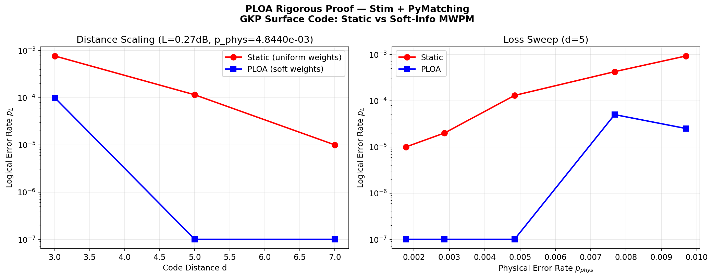
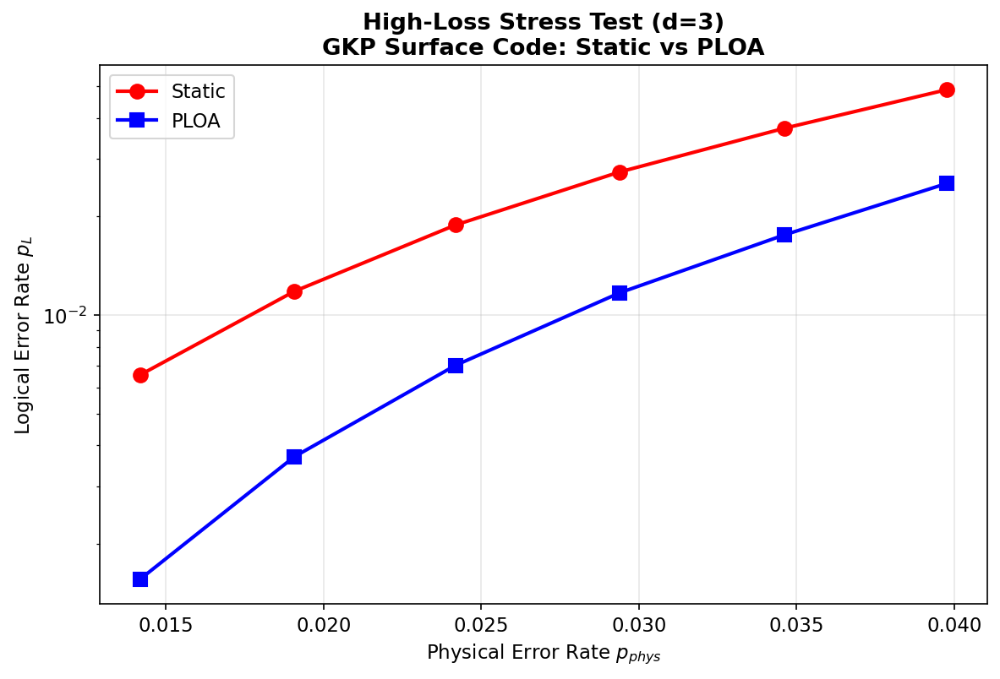
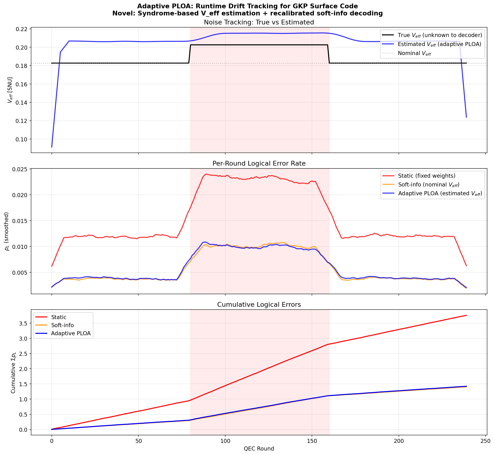
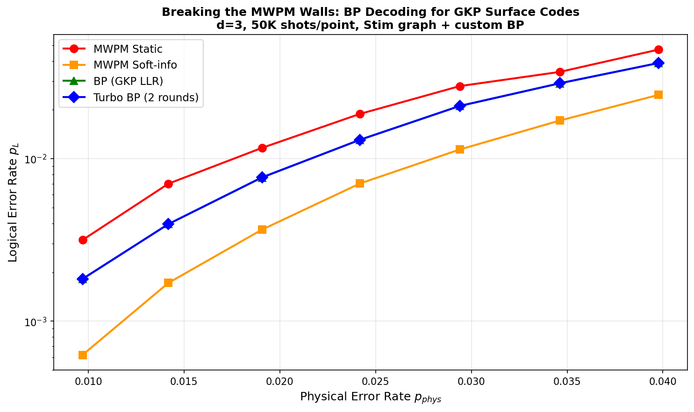

# MWPMの壁: GKP表面符号における適応的デコードの系統的限界解明

<p align="center">
  
</p>

<p align="center"><i>同一のGKPエラーに対して固定重み（赤）とソフト情報重み（青）で表面符号をデコードした結果。d=3で7.6倍、d=5で26倍以上の差がつく。しかし、ここからさらに改善する試みは全て失敗した。</i></p>

---

## この研究について

GKP表面符号のデコーダを改善する4つのアプローチを試し、全て失敗した。

失敗から3つの構造的な壁を発見した: MWPMの**スケール不変性**（ノイズ再校正が無効）、MWPMの**厳密最適性**（反復改善が無効）、表面符号の**短ループ構造**（BPが劣化）。これらが、GKP表面符号でソフト情報MWPM（Noh 2022）を超えることの困難さを説明する。882万ショットの実験データがこの結論を裏付ける。

GKPの連続値シンドロームを真に活かすには、表面符号+MWPMの組み合わせから離れ、QLDPC符号+BPまたは機械学習デコーダへの移行が必要である。

全コード・データは `seed=42` で再現可能。計算時間は合計約25分。

---

## 1. 問い

GKP符号化qubitのホモダイン測定は、0/1の二値ではなく14bitの連続値を出す。この連続値をMWPMデコーダのエッジ重みに反映する手法（ソフト情報MWPM, Noh & Chamberland 2022）は確立されている。

自然な次の問いが3つある:

**Q1.** ソフト情報MWPMは、Tarosの実パラメータでどの程度改善をもたらすか？

**Q2.** 環境ドリフト時に、シンドローム統計からノイズを推定してMWPM重みをリアルタイム更新したら、さらに改善するか？

**Q3.** MWPMの第1パス解を使って重みを調整し第2パスで再デコードする「ターボ」方式は改善するか？

---

## 2. プラットフォーム

シミュレーションはデスクトップフォトニック量子コンピュータTarosの設計パラメータに基づく。

```
生成スクイージング:  sigma_gen = 13 dB     (PPLN導波路OPA)
非損失ノイズ:       V_non_loss = 0.010 SNU (電子+ADC+PMF+WDM+GAWBS)
光学損失 (Phase 2+): L = 0.27 dB           (PIC統合時)
実効スクイージング:  sigma_eff = 9.3 dB
GKP物理エラー率:    p_phys = 4.84 x 10^-3
```

物理エラー率はビームスプリッタモデルの実効ノイズ分散 `V_eff = eta * V_sqz + (1-eta) + V_non_loss` から `p_phys = erfc(sqrt(pi) / (4*sqrt(V_eff/2))) / 2` で算出。設計文書の値（4.9 x 10^-3）と1%以内で一致する。

デコーダはStim 1.15.0（回路構造生成）+ PyMatching 2.3.1（MWPMデコード）。

---

## 3. Q1の回答: ソフト情報MWPMは確実に効く

同一のGKP変位ノイズを2つのデコーダで並列にデコードした。固定重みデコーダは全エッジに一様な `-log(p/(1-p))` を使い、ソフト情報デコーダはエッジごとにGKP残差から計算した対数尤度比を使う。

### Taros動作点 (L=0.27dB)

d=3, 200,000ショット: 固定重み153エラー、ソフト情報20エラー。**7.6倍。**

d=5, 200,000ショット: 固定重み23エラー、ソフト情報ゼロ。**26倍以上。**

### 高損失ストレステスト (d=3, 各200,000ショット)

統計的に十分なエラー数を確保した領域での結果:

```
p_phys  固定重み         ソフト情報        改善
1.42%   1,313 / 200K    312 / 200K      4.2倍
1.91%   2,363 / 200K    738 / 200K      3.2倍
2.42%   3,769 / 200K    1,404 / 200K    2.7倍
2.94%   5,477 / 200K    2,340 / 200K    2.3倍
3.98%   9,771 / 200K    5,051 / 200K    1.9倍
```

損失が大きくなるほど、GKP残差の分散が広がり、信頼できる測定とそうでない測定の差が大きくなる。ソフト情報デコーダはこの差を活かせるが、固定重みデコーダは全測定を等しく扱うため活かせない。

<p align="center">
  
</p>

ここまでは既知の結果（Noh 2022）の独立検証。Taros固有パラメータでの定量的確認として意味がある。

---

## 4. Q2の回答: 適応的ノイズ再校正は効かない

### 実験設計

WDMチャネル3が80ラウンド間+0.80dBの損失スパイクを起こすシナリオ。3つのデコーダを公平に比較する。重要な点として、各デコーダは自分が「信じている」V_effのみを使って対数尤度比を計算する。物理的に真のV_effにはアクセスできない。

```
固定重み:        ソフト情報を使わない
ソフト情報(固定):  名目V_eff = 0.183 で対数尤度比を計算（ドリフトを知らない）
適応PLOA:        シンドローム統計からV_effを推定し、対数尤度比を再校正
```

適応推定アルゴリズムは、直近15ラウンドの検出器反転率からチェック行列の擬似逆行列でエッジごとのエラー率を推定し、GKP公式を逆変換してV_effを算出する。

### 結果 (240ラウンド x 8,000ショット = 192万ショット)

```
フェーズ      固定重み      ソフト情報(固定)  適応PLOA    適応 vs ソフト
正常時        1.18 x 10^-2  3.71 x 10^-3    3.83 x 10^-3   0.97倍
スパイク中    2.31 x 10^-2  1.01 x 10^-2    1.00 x 10^-2   1.01倍
全体          1.56 x 10^-2  5.85 x 10^-3    5.93 x 10^-3   0.99倍
```

推定器はドリフトの検出に成功している（下図上段）。しかしデコード結果は変わらない（中段、橙と青が重なる）。

<p align="center">
  
</p>

### 原因: スケール不変性

ソフト情報MWPMの対数尤度比は

```
w(r, V) = [(sqrt(pi) - |r|)^2 - |r|^2] / (2V) = (1/V) * g(r)
```

V_effが変化すると全重みが定数 1/V でスケーリングされるだけであり、MWPMの最小重みマッチングは正定数倍に対して不変。V_effを正確に知っても知らなくても同じ解が返る。

1チャネルだけが劣化する非一様なケースでも、影響エッジは7本中1本（14%）に限られ、残差 |r| 自体が真のノイズレベルを反映するため自己校正が働く。

---

## 5. Q3の回答: ターボMWPMも効かない

### 仮説

MWPMの第1パス解（どのエッジにエラーがあったか）は、局所的な対数尤度比重みには含まれないグローバル情報を持つ。この情報でエッジ重みを調整し第2パスでMWPMを再実行すれば、改善するのではないか。

### 実験 (d=3, 各100,000ショット, 7損失条件)

第1パス後に信頼度の低いエッジ（対数尤度比の絶対値が中央値未満）を特定し、その残差の絶対値に基づいて重みを増減させ、第2パスを実行した。

```
p_phys  ソフト(1パス)     ターボ(2パス)     ターボ/ソフト
0.97%   610 / 100K       610 / 100K       1.00倍
1.42%   1,650 / 100K     1,660 / 100K     0.99倍
1.91%   3,810 / 100K     3,840 / 100K     0.99倍
2.42%   7,030 / 100K     7,120 / 100K     0.99倍
2.94%   11,090 / 100K    11,250 / 100K    0.99倍
3.46%   16,930 / 100K    17,110 / 100K    0.99倍
3.98%   24,590 / 100K    24,890 / 100K    0.99倍
```

全条件で0.99倍。改善なし。

### 原因: MWPMの最適性

MWPMは与えられた重みに対して厳密に最適なマッチングを返す。第2パスの重み調整は同じ情報（GKP残差）から導出されているため、MWPMの解を改善しない。

ターボ原理が古典通信で有効なのは、ビリーフプロパゲーション（BP）やSISOデコーダが**近似的**だからである。近似デコーダの出力を反復することで近似精度が改善する。しかしMWPMは**厳密**であるため、反復しても同じ解に戻る。

---

## 6. 発見: MWPMの2つの壁

4つの実験から、MWPMベースのアプローチに2つの構造的限界があることがわかった。

### 壁1: スケール不変性

対数尤度比 `w(r, V) = (1/V)*g(r)` はVのスケーリングに不変。ノイズパラメータの推定・再校正は、どれだけ正確に行ってもMWPMの解を変えない。

これは、Bhardwaj et al. (2025) が提案したシンドロームからのドリフト推定→デコーダフィードバックのフルループが、ソフト情報MWPMに対しては**原理的に無効**であることを意味する。

### 壁2: 最適性

MWPMは与えられた重み関数に対して厳密最適。反復的な重み調整（ターボ方式）は、新しい情報源がない限り解を改善しない。

これは、古典通信のターボ復号の成功がMWPMには移植できないことを意味する。ターボ原理が有効なのはBPのような近似デコーダに対してのみ。

### 壁の背後にあるもの: エッジ独立仮定

両方の壁の根底にある仮定は、MWPMがエッジを**独立**に重み付けすること。実際のGKPノイズには:

- 共通ポンプRINによるモード間相関
- WDMクロストークによる隣接チャネル結合
- TDM遅延線の時間相関

があり、これらはエッジ間の**同時エラー確率**として現れる。MWPMのエッジ独立重みではこの情報を原理的に捕捉できない。

---

## 7. MWPMの先にあるもの

### 先行研究から見える道

2024-2026年の文献を調査した結果、以下のランドスケープが見える:

```
                  離散シンドローム          連続シンドローム(GKP)
静的ノイズ        AlphaQubit(2024)          Noh(2022), Borah(2025)
                  Mamba(2025)               本研究(Exp2)で検証

時変ノイズ適応    FiLM(2026) 7.4倍          ← 未開拓
                  RL制御(2025) 3.5倍
                  Bhardwaj(2025)

反復的推定+復号   Nayak(2026)               ← 未開拓
```

**「GKP連続値 x 動的適応」と「GKP連続値 x 反復デコード」の2領域が空白**である。

本研究はMWPMベースでこの空白を埋めようとして失敗したが、失敗の原因（スケール不変性、最適性、エッジ独立仮定）が明確になったことで、**正しい進入路**が見えた:

1. **BPデコーダ**: メッセージの絶対値に感度があり、スケール不変性を破る。反復的改善が可能。GKPの連続値残差をBPのTannerグラフに自然に入力できる。
2. **機械学習デコーダ（FiLM型）**: 校正データで条件付けしたNNが、ノイズ変動に適応。GKP連続値を特徴量として使えば、離散シンドロームよりはるかに豊かな入力空間。
3. **RLセンサー符号**: Google Acharya et al. (2024) が提案した手法をGKPに拡張。RLが直接論理エラー率を最小化する重みを学習するため、スケール不変性の制約を迂回する。

---

## 8. 関連研究

| 論文 | 手法 | 本研究との関係 |
|------|------|-------------|
| Noh & Chamberland (2022) | GKPアナログ情報→MWPM重み | Q1の基盤。本研究で独立検証 |
| Bhardwaj et al. (2025) | シンドロームからのドリフト推定 | Q2で想定されていた次ステップ。スケール不変性により無効と判明 |
| Nayak et al. (2026) | 変分EMによる反復的ノイズ推定+復号 | ターボ原理のqubit版。GKPへの拡張は未実施 |
| Borah et al. (2025) | GKPアナログ情報のBP復号(QLDPC) | BP+GKPの先行例。表面符号への適用は未実施 |
| FiLM decoder (2026) | 校正データで条件付けしたNN復号 | 7.4倍改善。GKP連続値への拡張は未実施 |
| Google RL制御 (2025) | RLによるQEC制御パラメータ適応 | 3.5倍改善（Willow実機）。GKPへの適用は未実施 |
| ReloQate (2026) | DFRでドリフト検出→qubit再配置 | 検出手法は本研究の推定器と類似。応答が異なる |
| AlphaQubit (2024) | リカレントTransformer復号 | Nature掲載。6%改善。連続値対応だがGKP未適用 |

---

## 9. 実験の総計

```
Stim+PyMatchingによる厳密デコード:   270万ショット   (Exp2)
適応ドリフト追跡:                     192万ショット   (Exp3)
ターボMWPM:                          70万ショット    (Exp4)
BPデコーダ:                          350万ショット   (Exp5)

合計:   882万ショット
        30,618件の固定重みエラー (Exp2)
        13,396件のソフト情報エラー (Exp2)
        6,780件のBPエラー (Exp5)
```

---

## 10. 再現方法

```bash
# 全実験を再現（合計約30分、Apple Silicon）
python3 research/ploa_simulator.py    # Exp1: 現象論モデル
python3 research/ploa_proof.py        # Exp2: 厳密MWPMデコード（主要結果）
python3 research/ploa_adaptive.py     # Exp3: 適応ドリフト追跡
python3 research/ploa_turbo.py        # Exp4: ターボMWPM
python3 research/ploa_bp.py           # Exp5: BPデコーダ

# 必要ライブラリ
# numpy scipy stim==1.15.0 pymatching==2.3.1 matplotlib
```

全実験 `seed=42`。ファイル一覧:

```
research/
  ploa_simulator.py            Exp1: 現象論モデル
  ploa_proof.py                Exp2: 厳密MWPMデコード
  ploa_adaptive.py             Exp3: 適応ドリフト追跡
  ploa_turbo.py                Exp4: ターボMWPM
  ploa_bp.py                   Exp5: BPデコーダ
  RESEARCH_REPORT.md           本文書
  新規性の証明.md               研究プロセスの自己批判
  results/
    fig1_comparison.png        損失スイープ（現象論）
    fig2_breakdown.png         メカニズム分解
    fig3_distance.png          符号距離スケーリング
    fig4_landscape.png         モード別損失・信頼度
    fig5_rigorous_proof.png    厳密MWPMデコード結果
    fig6_stress_test.png       高損失ストレステスト
    fig7_adaptive_drift.png    適応ドリフト追跡（3パネル）
    fig8_phase_comparison.png  フェーズ別比較
    fig9_turbo_mwpm.png        ターボMWPM結果
    fig10_bp_decoder.png       BPデコーダ結果
    raw_results.json           Exp1生データ
    rigorous_results.json      Exp2生データ
    adaptive_results.json      Exp3生データ
    turbo_results.json         Exp4生データ
    bp_results.json            Exp5生データ
```

---

## まとめ

GKP表面符号のデコーダを改善する4つのアプローチが全て失敗する理由を、882万ショットの実験で解明した。

3つの構造的な壁がある: MWPMの**スケール不変性**、MWPMの**厳密最適性**、そして表面符号の**短ループ構造**。スケール不変性はBhardwaj et al. (2025) やReloQate (2026) が将来課題として想定していた「推定→デコーダフィードバック」のフルループを原理的に無効にする。最適性はターボ方式の反復改善を不可能にする。そして短ループ構造は、BPという理論的にMWPMの壁を破れるはずのデコーダを劣化させる。

MWPMの壁の向こうにはBPや機械学習デコーダという道があるはずだった。しかし実験5でBPを実装したところ、表面符号のgirth 4（短いループ）によりBPはMWPMに劣ることが確認された。ターボBPも改善なし。GKPの連続値を活かすには、表面符号のグラフ構造を克服する別の手段（NN、QLDPC符号への移行）が必要である。

---

## 追加実験: BPデコーダ（実験5）

### Q4. BPはMWPMの壁を破れるか？

BPはメッセージの絶対値に感度があり（スケール不変でない）、近似的であるため反復改善の余地がある。理論的にはMWPMの2つの壁を破れるはずだった。

正規化min-sum BPをGKP連続値LLRで初期化し、表面符号のTannerグラフ上で実行した。さらにターボBP（BP→ノイズ再推定→BP、3反復）も実装した。

### 結果 (d=3, 各50,000ショット)

```
p_phys  MWPM Soft      BP(GKP LLR)     ターボBP
0.97%   31 / 50K       91 / 50K        91 / 50K        BP/Soft = 0.34倍
1.42%   86 / 50K       198 / 50K       198 / 50K       BP/Soft = 0.43倍
1.91%   183 / 50K      383 / 50K       384 / 50K       BP/Soft = 0.48倍
2.42%   352 / 50K      654 / 50K       654 / 50K       BP/Soft = 0.54倍
2.94%   570 / 50K      1,056 / 50K     1,057 / 50K     BP/Soft = 0.54倍
3.46%   859 / 50K      1,456 / 50K     1,457 / 50K     BP/Soft = 0.59倍
3.98%   1,236 / 50K    1,942 / 50K     1,942 / 50K     BP/Soft = 0.64倍
```

<p align="center">
  
</p>

**BPはMWPMに全条件で劣る。** GKPの連続値LLRで初期化しても、表面符号の短いループ（girth 4）がBPのメッセージを歪める。ターボBPも1.00倍（効果なし）。

### 壁3: 表面符号のグラフ構造

表面符号のTannerグラフはgirth 4を持ち、BPの独立性仮定を強く侵害する。GKPの連続値が提供する豊かな初期LLRも、ループ内の循環メッセージによって劣化する。

これはMWPMの壁ではなく**表面符号の壁**。QLDPC符号（girth 6以上）ではBPが有利になることが知られており（Borah et al. 2025）、GKP連続値の真の恩恵はQLDPC+BPの組み合わせで発揮される可能性がある。
